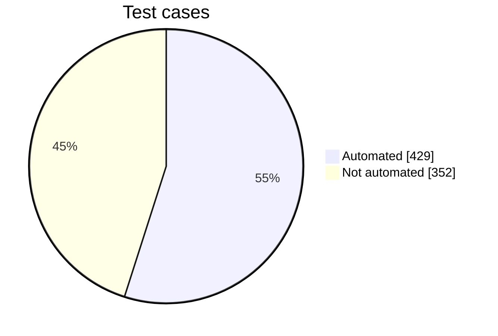
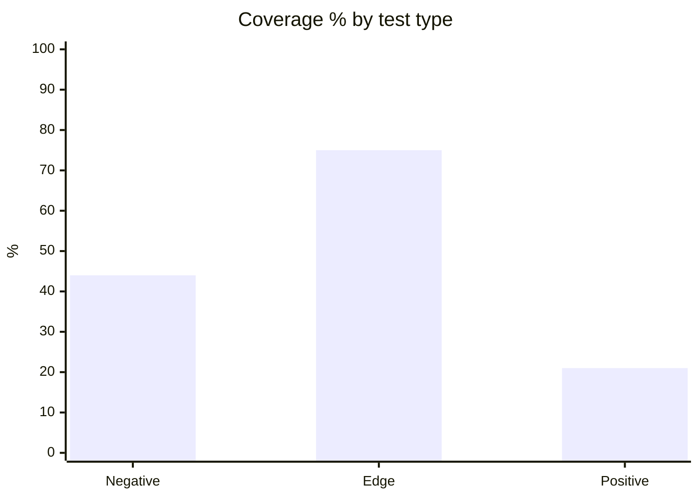
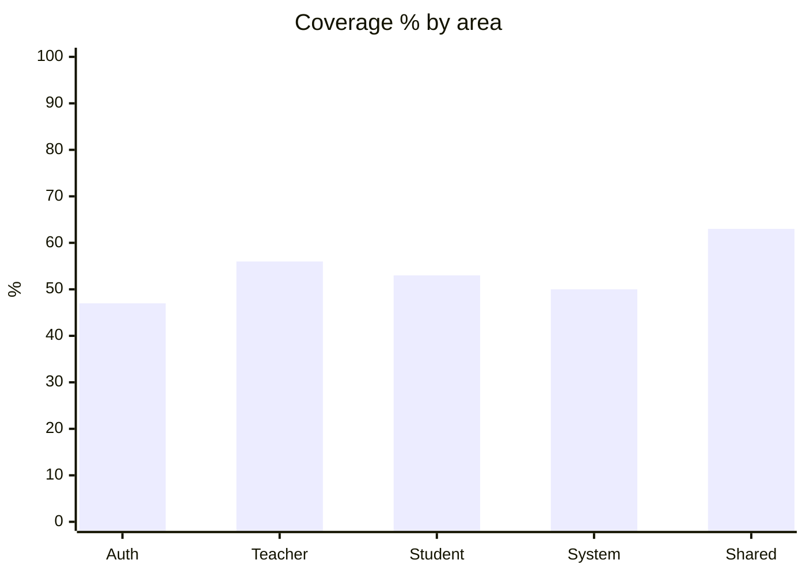
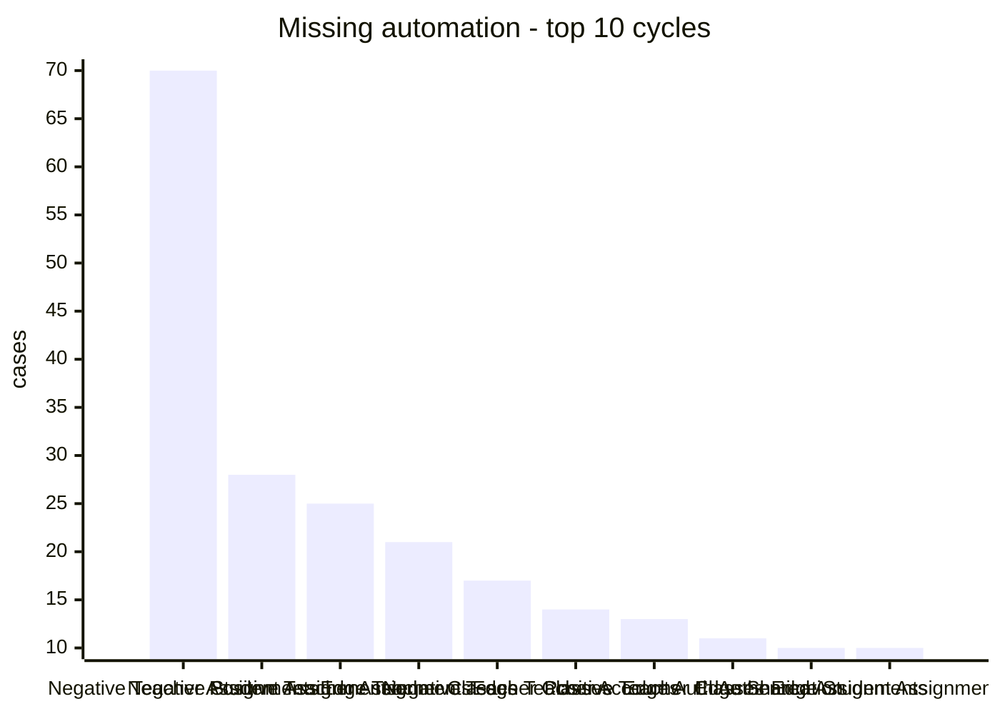

# Automation Coverage Report

> How many test cases in the Zephyr Google Sheet already have an automated test in `teacher-student-automation` and `admin-staff-automation`.

*Generated 2026-10-05 · Sheet gid 490497427 · 2 automation projects · 781 test cases*

## 1. At a glance

| Automated | Not yet automated | Total | Coverage |
|--:|--:|--:|--:|
| **429** | **352** | **781** | **54.9%** |

`██████████████████████░░░░░░░░░░░░░░░░░░` 54.9%

### Contribution by project

| Project | Cases matched | Matched only here |
|---|--:|--:|
| teacher-student-automation | 428 | 426 |
| admin-staff-automation | 2 | 0 |

> **admin-staff-automation** is a separate admin/staff-portal suite. It names its tests with its own ids (`EI-TC-###`, `EI-####`, `STAF-...`), not the sheet's Zephyr `EI-T###` keys, so it matches almost nothing. Its tests were not mapped by title, which would be guesswork. See Method & limits.

## 2. Coverage by test type

| Type | Automated | Total | Coverage | |
|---|--:|--:|--:|---|
| Negative | 131 | 297 | 44% | `█████████░░░░░░░░░░░` |
| Edge | 272 | 363 | 75% | `███████████████░░░░░` |
| Positive | 26 | 121 | 21% | `████░░░░░░░░░░░░░░░░` |

## 3. Coverage by area

| Area | Automated | Total | Coverage | |
|---|--:|--:|--:|---|
| Auth | 16 | 34 | 47% | `█████████░░░░░░░░░░░` |
| Teacher | 275 | 492 | 56% | `███████████░░░░░░░░░` |
| Student | 117 | 220 | 53% | `███████████░░░░░░░░░` |
| System | 4 | 8 | 50% | `██████████░░░░░░░░░░` |
| Shared | 17 | 27 | 63% | `█████████████░░░░░░░` |

## 4. Where the gaps are

Top 10 test cycles by number of cases still **not automated**. Start here for the biggest wins.

| # | Cycle | Missing | Automated | Total | |
|--:|---|--:|--:|--:|---|
| 1 | Negative_Teacher_Assignments | **70** | 5 | 75 | `████████████████████` |
| 2 | Negative_Student_Assignments | **28** | 4 | 32 | `████████░░░░░░░░░░░░` |
| 3 | Positive_Teacher_Assignments | **25** | 0 | 25 | `███████░░░░░░░░░░░░░` |
| 4 | Edge_Teacher_Classes | **21** | 33 | 54 | `██████░░░░░░░░░░░░░░` |
| 5 | Negative_Teacher_Classes | **17** | 40 | 57 | `█████░░░░░░░░░░░░░░░` |
| 6 | Edge_Teacher_Accounts | **14** | 7 | 21 | `████░░░░░░░░░░░░░░░░` |
| 7 | Positive_Teacher_Classes | **13** | 5 | 18 | `████░░░░░░░░░░░░░░░░` |
| 8 | Edge_Auth_Authentication | **11** | 9 | 20 | `███░░░░░░░░░░░░░░░░░` |
| 9 | Edge_Shared_Assignments | **10** | 17 | 27 | `███░░░░░░░░░░░░░░░░░` |
| 10 | Edge_Student_Assignments | **10** | 12 | 22 | `███░░░░░░░░░░░░░░░░░` |

These 10 cycles hold **219 of the 352** missing cases (62%).

### Cycles with no automation at all

- Negative_Auth_Login (3 cases)
- Negative_Auth_Password Reset (3 cases)
- Negative_Teacher_Dashboard (4 cases)
- Negative_Teacher_Theme (7 cases)
- Negative_Teacher_Features (8 cases)
- Negative_Student_Dashboard (7 cases)
- Edge_System_Webhooks (4 cases)
- Edge_Teacher_Dashboard (8 cases)
- Positive_Teacher_Dashboard (4 cases)
- Positive_Teacher_Theme (4 cases)
- Positive_Teacher_Features (6 cases)
- Positive_Teacher_Assignments (25 cases)
- Positive_Student_Accounts (7 cases)
- Positive_Student_Classes (6 cases)
- Positive_Student_Features (5 cases)

### Fully automated cycles

Negative_Auth_Profile, Negative_Teacher_Question, Negative_Teacher_Question Import, Negative_Student_Classes, Edge_System_Health, Edge_Teacher_Question, Edge_Teacher_Assignments, Edge_Teacher_Theme, Edge_Teacher_Students, Edge_Student_Dashboard, Edge_Student_Classes, Edge_Student_Theme, Positive_Auth_Login, Positive_Auth_Session, Positive_Auth_Profile, Positive_Auth_Password Reset, Positive_Teacher_Accounts

## 5. Coverage by owner

| Owner | Automated | Total | Coverage | |
|---|--:|--:|--:|---|
| Khyne | 101 | 101 | 100% | `████████████████████` |
| (unassigned) | 1 | 1 | 100% | `████████████████████` |
| Jim | 86 | 109 | 79% | `████████████████░░░░` |
| Trishia | 27 | 36 | 75% | `███████████████░░░░░` |
| Allan | 59 | 106 | 56% | `███████████░░░░░░░░░` |
| Paul | 132 | 260 | 51% | `██████████░░░░░░░░░░` |
| Gelo | 23 | 161 | 14% | `███░░░░░░░░░░░░░░░░░` |
| Dr. Uzaka | 0 | 7 | 0% | `░░░░░░░░░░░░░░░░░░░░` |

## 6. All test cycles

Sorted from lowest to highest coverage.

| Cycle | Automated | Total | Coverage | |
|---|--:|--:|--:|---|
| Positive_Teacher_Assignments | 0 | 25 | 0% | `░░░░░░░░░░░░░░░░░░░░` |
| Negative_Teacher_Features | 0 | 8 | 0% | `░░░░░░░░░░░░░░░░░░░░` |
| Edge_Teacher_Dashboard | 0 | 8 | 0% | `░░░░░░░░░░░░░░░░░░░░` |
| Negative_Teacher_Theme | 0 | 7 | 0% | `░░░░░░░░░░░░░░░░░░░░` |
| Negative_Student_Dashboard | 0 | 7 | 0% | `░░░░░░░░░░░░░░░░░░░░` |
| Positive_Student_Accounts | 0 | 7 | 0% | `░░░░░░░░░░░░░░░░░░░░` |
| Positive_Teacher_Features | 0 | 6 | 0% | `░░░░░░░░░░░░░░░░░░░░` |
| Positive_Student_Classes | 0 | 6 | 0% | `░░░░░░░░░░░░░░░░░░░░` |
| Positive_Student_Features | 0 | 5 | 0% | `░░░░░░░░░░░░░░░░░░░░` |
| Negative_Teacher_Dashboard | 0 | 4 | 0% | `░░░░░░░░░░░░░░░░░░░░` |
| Edge_System_Webhooks | 0 | 4 | 0% | `░░░░░░░░░░░░░░░░░░░░` |
| Positive_Teacher_Dashboard | 0 | 4 | 0% | `░░░░░░░░░░░░░░░░░░░░` |
| Positive_Teacher_Theme | 0 | 4 | 0% | `░░░░░░░░░░░░░░░░░░░░` |
| Negative_Auth_Login | 0 | 3 | 0% | `░░░░░░░░░░░░░░░░░░░░` |
| Negative_Auth_Password Reset | 0 | 3 | 0% | `░░░░░░░░░░░░░░░░░░░░` |
| Negative_Teacher_Assignments | 5 | 75 | 7% | `█░░░░░░░░░░░░░░░░░░░` |
| Positive_Teacher_Question | 1 | 9 | 11% | `██░░░░░░░░░░░░░░░░░░` |
| Negative_Student_Assignments | 4 | 32 | 12% | `██░░░░░░░░░░░░░░░░░░` |
| Positive_Student_Dashboard | 1 | 7 | 14% | `███░░░░░░░░░░░░░░░░░` |
| Positive_Student_Assignments | 2 | 10 | 20% | `████░░░░░░░░░░░░░░░░` |
| Positive_Teacher_Classes | 5 | 18 | 28% | `██████░░░░░░░░░░░░░░` |
| Edge_Teacher_Accounts | 7 | 21 | 33% | `███████░░░░░░░░░░░░░` |
| Negative_Student_Accounts | 6 | 15 | 40% | `████████░░░░░░░░░░░░` |
| Negative_Student_Theme | 3 | 7 | 43% | `█████████░░░░░░░░░░░` |
| Negative_Student_Features | 3 | 7 | 43% | `█████████░░░░░░░░░░░` |
| Edge_Auth_Authentication | 9 | 20 | 45% | `█████████░░░░░░░░░░░` |
| Positive_Student_Theme | 2 | 4 | 50% | `██████████░░░░░░░░░░` |
| Negative_Auth_Session | 1 | 2 | 50% | `██████████░░░░░░░░░░` |
| Edge_Student_Assignments | 12 | 22 | 55% | `███████████░░░░░░░░░` |
| Edge_Teacher_Classes | 33 | 54 | 61% | `████████████░░░░░░░░` |
| Edge_Shared_Assignments | 17 | 27 | 63% | `█████████████░░░░░░░` |
| Edge_Teacher_Features | 8 | 12 | 67% | `█████████████░░░░░░░` |
| Edge_Student_Features | 7 | 10 | 70% | `██████████████░░░░░░` |
| Negative_Teacher_Classes | 40 | 57 | 70% | `██████████████░░░░░░` |
| Positive_Teacher_Question Impact | 4 | 5 | 80% | `████████████████░░░░` |
| Edge_Student_Accounts | 19 | 23 | 83% | `█████████████████░░░` |
| Edge_Teacher_Question-Import | 14 | 16 | 88% | `██████████████████░░` |
| Negative_Teacher_Account | 14 | 15 | 93% | `███████████████████░` |
| Edge_Teacher_Assignments | 54 | 54 | 100% | `████████████████████` |
| Edge_Teacher_Question | 25 | 25 | 100% | `████████████████████` |
| Negative_Teacher_Question | 20 | 20 | 100% | `████████████████████` |
| Negative_Teacher_Question Import | 18 | 18 | 100% | `████████████████████` |
| Negative_Student_Classes | 16 | 16 | 100% | `████████████████████` |
| Edge_Student_Classes | 15 | 15 | 100% | `████████████████████` |
| Edge_Student_Dashboard | 14 | 14 | 100% | `████████████████████` |
| Edge_Teacher_Theme | 13 | 13 | 100% | `████████████████████` |
| Edge_Student_Theme | 13 | 13 | 100% | `████████████████████` |
| Edge_Teacher_Students | 8 | 8 | 100% | `████████████████████` |
| Positive_Teacher_Accounts | 6 | 6 | 100% | `████████████████████` |
| Edge_System_Health | 4 | 4 | 100% | `████████████████████` |
| Positive_Auth_Session | 2 | 2 | 100% | `████████████████████` |
| Negative_Auth_Profile | 1 | 1 | 100% | `████████████████████` |
| Positive_Auth_Login | 1 | 1 | 100% | `████████████████████` |
| Positive_Auth_Profile | 1 | 1 | 100% | `████████████████████` |
| Positive_Auth_Password Reset | 1 | 1 | 100% | `████████████████████` |

## 7. Detail lists

Click to expand.

<b>Not automated (352)</b> - grouped by cycle

**Negative_Auth_Login** (3)

- EI-T122 - Authenticating with credentials without the required email field is rejected
- EI-T123 - Authenticating with credentials with password supplied as the wrong data type is rejected
- EI-T124 - Authenticating with credentials with an empty or over-length email value is rejected

**Negative_Auth_Session** (1)

- EI-T126 - Logging out with malformed request parameters returns no server error

**Negative_Auth_Password Reset** (3)

- EI-T128 - Requesting a password reset without the required email field is rejected
- EI-T129 - Requesting a password reset with email supplied as the wrong data type is rejected
- EI-T130 - Requesting a password reset with an empty or over-length email value is rejected

**Negative_Teacher_Account** (1)

- EI-T138 - Deleting a teacher profile picture with a malformed teacherId value is rejected

**Negative_Teacher_Dashboard** (4)

- EI-T146 - Fetching class statistics with malformed request parameters returns no server error
- EI-T147 - Fetching student statistics with malformed request parameters returns no server error
- EI-T148 - Fetching assignment statistics with malformed request parameters returns no server error
- EI-T149 - Fetching submission statistics with malformed request parameters returns no server error

**Negative_Teacher_Classes** (17)

- EI-T158 - Fetching class announcements with the class identifier omitted is rejected
- EI-T159 - Fetching class announcements with an excessively long or unknown class identifier is rejected
- EI-T160 - Posting a class announcement without the required content field is rejected
- EI-T161 - Posting a class announcement with content supplied as the wrong data type is rejected
- EI-T162 - Posting a class announcement with an empty or over-length content value is rejected
- EI-T173 - Updating class details without the required title field is rejected
- EI-T174 - Updating class details with section supplied as the wrong data type is rejected
- EI-T175 - Updating class details with an unsupported semester value is rejected
- EI-T184 - Updating a class cover photo with no file attached is rejected
- EI-T185 - Updating a class cover photo with an unsupported file type is rejected
- EI-T186 - Updating a class cover photo with an empty file and with an oversized file is rejected
- EI-T192 - Restoring a soft-deleted class with the class identifier omitted is rejected
- EI-T193 - Restoring a soft-deleted class with an excessively long or unknown class identifier is rejected
- EI-T198 - Removing a student from a class with the student identifier omitted is rejected
- EI-T199 - Removing a student from a class with an excessively long or unknown student identifier is rejected
- EI-T205 - Fetching class assignments with the class identifier omitted is rejected
- EI-T206 - Fetching class assignments with an excessively long or unknown class identifier is rejected

**Negative_Teacher_Assignments** (70)

- EI-T245 - Creating an assignment without the required title field is rejected
- EI-T246 - Creating an assignment with questions supplied as the wrong data type is rejected
- EI-T247 - Creating an assignment with an unsupported type value is rejected
- EI-T248 - Fetching class assignments for a teacher with a malformed class code is rejected
- EI-T249 - Fetching class assignments for a teacher with the class code omitted is rejected
- EI-T251 - Creating a staff assignment without the required description field is rejected
- EI-T252 - Creating a staff assignment with questions supplied as the wrong data type is rejected
- EI-T253 - Creating a staff assignment with an unsupported type value is rejected
- EI-T254 - Fetching all staff assignments with malformed request parameters returns no server error
- EI-T255 - Fetching a staff assignment with a malformed assignment identifier is rejected
- EI-T256 - Fetching a staff assignment with the assignment identifier omitted is rejected
- EI-T257 - Fetching a staff assignment with an excessively long or unknown assignment identifier is rejected
- EI-T258 - Fetching a teacher assignment with a malformed assignment identifier is rejected
- EI-T259 - Fetching a teacher assignment with the assignment identifier omitted is rejected
- EI-T260 - Fetching a teacher assignment with an excessively long or unknown assignment identifier is rejected
- EI-T261 - Updating an assignment with questions supplied as the wrong data type is rejected
- EI-T262 - Updating an assignment with passing_grade outside its accepted range is rejected
- EI-T263 - Updating an assignment with a malformed assignment identifier is rejected
- EI-T264 - Overriding a question point value without the required points field is rejected
- EI-T265 - Overriding a question point value with points supplied as the wrong data type is rejected
- EI-T266 - Overriding a question point value with points outside its accepted range is rejected
- EI-T267 - Overriding a question point value with a malformed assignment identifier is rejected
- EI-T268 - Deleting an assignment with a malformed assignment identifier is rejected
- EI-T269 - Deleting an assignment with the assignment identifier omitted is rejected
- EI-T270 - Deleting an assignment with an excessively long or unknown assignment identifier is rejected
- EI-T271 - Fetching assignment analytics summary with a malformed assignment identifier is rejected
- EI-T272 - Fetching assignment analytics summary with the assignment identifier omitted is rejected
- EI-T273 - Fetching assignment analytics summary with an excessively long or unknown assignment identifier is rejected
- EI-T274 - Fetching assignment item analysis with a malformed assignment identifier is rejected
- EI-T275 - Fetching assignment item analysis with the assignment identifier omitted is rejected
- EI-T277 - Fetching a student submission with a malformed student identifier is rejected
- EI-T278 - Fetching a student submission with the student identifier omitted is rejected
- EI-T279 - Fetching a student submission with an excessively long or unknown student identifier is rejected
- EI-T280 - Adding a comment on a student answer without the required comment field is rejected
- EI-T281 - Adding a comment on a student answer with comment supplied as the wrong data type is rejected
- EI-T282 - Adding a comment on a student answer with an empty or over-length comment value is rejected
- EI-T283 - Adding a comment on a student answer with a malformed question identifier is rejected
- EI-T284 - Updating a comment on a student answer without the required comment field is rejected
- EI-T285 - Updating a comment on a student answer with comment supplied as the wrong data type is rejected
- EI-T286 - Updating a comment on a student answer with an empty or over-length comment value is rejected
- EI-T287 - Updating a comment on a student answer with a malformed question identifier is rejected
- EI-T291 - Listing pending late submissions with a malformed assignment identifier is rejected
- EI-T292 - Listing pending late submissions with the assignment identifier omitted is rejected
- EI-T293 - Listing pending late submissions with an excessively long or unknown assignment identifier is rejected
- EI-T294 - Approving a late submission with late_penalty supplied as the wrong data type is rejected
- EI-T295 - Approving a late submission with late_penalty outside its accepted range is rejected
- EI-T296 - Approving a late submission with a malformed submission identifier is rejected
- EI-T297 - Rejecting a late submission with reason supplied as the wrong data type is rejected
- EI-T298 - Rejecting a late submission with an empty or over-length reason value is rejected
- EI-T299 - Rejecting a late submission with a malformed submission identifier is rejected
- EI-T393 - Creating an assignment through the shared service without the required questions field is rejected
- EI-T394 - Creating an assignment through the shared service with questions supplied as the wrong data type is rejected
- EI-T395 - Creating an assignment through the shared service with an unsupported type value is rejected
- EI-T396 - Retrieving an assignment through the shared service with a malformed assignment identifier is rejected
- EI-T397 - Retrieving an assignment through the shared service with the assignment identifier omitted is rejected
- EI-T398 - Retrieving an assignment through the shared service with an excessively long or unknown assignment identifier is rejected
- EI-T405 - Retrieving a submission for review with a malformed submission identifier is rejected
- EI-T406 - Retrieving a submission for review with the submission identifier omitted is rejected
- EI-T407 - Retrieving a submission for review with an excessively long or unknown submission identifier is rejected
- EI-T408 - Sharing an assignment without the required recipient_id field is rejected
- EI-T409 - Sharing an assignment with object_id supplied as the wrong data type is rejected
- EI-T410 - Sharing an assignment with an empty or over-length description value is rejected
- EI-T411 - Fetching shared assignment analytics with a malformed assignment identifier is rejected
- EI-T412 - Fetching shared assignment analytics with the assignment identifier omitted is rejected
- EI-T413 - Fetching shared assignment analytics with an excessively long or unknown assignment identifier is rejected
- EI-T414 - Updating an assignment through the shared service with questions supplied as the wrong data type is rejected
- EI-T415 - Updating an assignment through the shared service with passing_grade outside its accepted range is rejected
- EI-T416 - Updating an assignment through the shared service with a malformed assignment identifier is rejected
- EI-T417 - Deleting an assignment through the shared service without the required assignment_uuid parameter is rejected
- EI-T418 - Deleting an assignment through the shared service with a malformed assignment_uuid value is rejected

**Negative_Teacher_Theme** (7)

- EI-T300 - Fetching a teacher theme with malformed request parameters returns no server error
- EI-T301 - Applying a teacher theme without the required theme_id field is rejected
- EI-T302 - Applying a teacher theme with color_mode supplied as the wrong data type is rejected
- EI-T303 - Applying a teacher theme with an empty or over-length theme_id value is rejected
- EI-T304 - Updating teacher theme settings with colors supplied as the wrong data type is rejected
- EI-T305 - Updating teacher theme settings with an empty or over-length theme_name value is rejected
- EI-T306 - Deleting a teacher theme with malformed request parameters returns no server error

**Negative_Teacher_Features** (8)

- EI-T307 - Fetching teacher feature flags with malformed request parameters returns no server error
- EI-T308 - Fetching a single feature status for a teacher with a malformed feature name is rejected
- EI-T309 - Fetching a single feature status for a teacher with the feature name omitted is rejected
- EI-T310 - Fetching a single feature status for a teacher with an excessively long or unknown feature name is rejected
- EI-T311 - Fetching teacher organisation details with malformed request parameters returns no server error
- EI-T312 - Fetching teacher school details with malformed request parameters returns no server error
- EI-T313 - Fetching a teacher district plan with malformed request parameters returns no server error
- EI-T314 - Fetching a teacher assignment quota with a malformed class_code value is rejected

**Negative_Student_Accounts** (9)

- EI-T315 - Fetching a student account with a malformed id value is rejected
- EI-T320 - Adding a student profile picture with no file attached is rejected
- EI-T321 - Adding a student profile picture with an unsupported file type is rejected
- EI-T322 - Adding a student profile picture with an empty file and with an oversized file is rejected
- EI-T324 - Updating a student profile picture with an unsupported file type is rejected
- EI-T325 - Updating a student profile picture with an empty file and with an oversized file is rejected
- EI-T327 - Changing a student password without the required current_password field is rejected
- EI-T328 - Changing a student password with new_password supplied as the wrong data type is rejected
- EI-T329 - Changing a student password with an empty or over-length new_password value is rejected

**Negative_Student_Dashboard** (7)

- EI-T330 - Fetching achievement badges with malformed request parameters returns no server error
- EI-T331 - Fetching a grade distribution with malformed request parameters returns no server error
- EI-T332 - Fetching a student GPA with malformed request parameters returns no server error
- EI-T333 - Fetching upcoming assignments with an out-of-range limit value is rejected
- EI-T334 - Fetching student class statistics with malformed request parameters returns no server error
- EI-T335 - Fetching student assignment statistics with malformed request parameters returns no server error
- EI-T336 - Fetching student submission statistics with malformed request parameters returns no server error

**Negative_Student_Assignments** (28)

- EI-T353 - Fetching class assignments as a student with a malformed class code is rejected
- EI-T354 - Fetching class assignments as a student with the class code omitted is rejected
- EI-T355 - Fetching class assignments as a student with an excessively long or unknown class code is rejected
- EI-T356 - Fetching a class average grade with a malformed class code is rejected
- EI-T357 - Fetching a class average grade with the class code omitted is rejected
- EI-T359 - Fetching an assignment as a student with a malformed assignment identifier is rejected
- EI-T360 - Fetching an assignment as a student with the assignment identifier omitted is rejected
- EI-T361 - Fetching an assignment as a student with an excessively long or unknown assignment identifier is rejected
- EI-T362 - Fetching assignment questions with a malformed assignment identifier is rejected
- EI-T363 - Fetching assignment questions with the assignment identifier omitted is rejected
- EI-T364 - Fetching assignment questions with an excessively long or unknown assignment identifier is rejected
- EI-T366 - Saving assignment answers with answers supplied as the wrong data type is rejected
- EI-T367 - Saving assignment answers with an empty answers array is rejected
- EI-T368 - Saving assignment answers with a malformed assignment identifier is rejected
- EI-T370 - Submitting assignment answers with answers supplied as the wrong data type is rejected
- EI-T371 - Submitting assignment answers with an empty answers array is rejected
- EI-T372 - Submitting assignment answers with a malformed assignment identifier is rejected
- EI-T373 - Reporting a lockdown violation with type supplied as the wrong data type is rejected
- EI-T374 - Reporting a lockdown violation with an empty or over-length type value is rejected
- EI-T375 - Reporting a lockdown violation with a malformed assignment identifier is rejected
- EI-T376 - Fetching a student submission for review with a malformed assignment identifier is rejected
- EI-T377 - Fetching a student submission for review with the assignment identifier omitted is rejected
- EI-T378 - Fetching a student submission for review with an excessively long or unknown assignment identifier is rejected
- EI-T399 - Requesting the next adaptive item without the required prev_difficulty parameter is rejected
- EI-T400 - Requesting the next adaptive item with a malformed question_classification value is rejected
- EI-T401 - Requesting the next adaptive item with a malformed assignment identifier is rejected
- EI-T403 - Submitting an answer through the shared service with answers supplied as the wrong data type is rejected
- EI-T404 - Submitting an answer through the shared service with an empty answers array is rejected

**Negative_Student_Theme** (4)

- EI-T380 - Applying a student theme without the required theme_id field is rejected
- EI-T383 - Updating student theme settings with colors supplied as the wrong data type is rejected
- EI-T384 - Updating student theme settings with an empty or over-length theme_name value is rejected
- EI-T385 - Deleting a student theme with malformed request parameters returns no server error

**Negative_Student_Features** (4)

- EI-T387 - Fetching a single feature status for a student with a malformed feature name is rejected
- EI-T388 - Fetching a single feature status for a student with the feature name omitted is rejected
- EI-T389 - Fetching a single feature status for a student with an excessively long or unknown feature name is rejected
- EI-T392 - Fetching a student district plan with malformed request parameters returns no server error

**Edge_System_Webhooks** (4)

- EI-T778 - [Webhooks] Malformed Auth0 event payload is rejected without partial profile writes
- EI-T779 - [Webhooks] Replayed Auth0 user-sync event is processed idempotently
- EI-T780 - [Webhooks] Auth0 user-sync event without a shared secret header is rejected
- EI-T781 - [Webhooks] Auth0 user-sync event with an incorrect shared secret is rejected

**Edge_Auth_Authentication** (11)

- EI-T423 - [Authentication] Omitting the required field 'email' is rejected when attempting to login with email and password
- EI-T425 - [Authentication] Script payload in 'email' is neutralised when attempting to login with email and password
- EI-T427 - [Authentication] Expired or tampered refresh token is rejected during rotation
- EI-T429 - [Authentication] Session rotation without a refresh-token cookie is rejected
- EI-T431 - [Authentication] Expired or tampered refresh token is rejected during rotation (2)
- EI-T433 - [Authentication] Session rotation without a refresh-token cookie is rejected (2)
- EI-T435 - [Authentication] Expired bearer token is rejected when attempting to get current user profile
- EI-T437 - [Authentication] Missing Authorization header is rejected when attempting to get current user profile
- EI-T439 - [Authentication] Omitting the required field 'email' is rejected when attempting to request a password reset email
- EI-T440 - [Authentication] Password reset request for an unknown email does not enumerate accounts
- EI-T441 - [Authentication] Script payload in 'email' is neutralised when attempting to request a password reset email

**Edge_Teacher_Accounts** (14)

- EI-T443 - [Accounts] Unknown 'search' filter value returns no matches when attempting to search for users by name/email and role, or return current user account
- EI-T444 - [Accounts] Expired bearer token is rejected when attempting to search for users by name/email and role, or return current user account
- EI-T446 - [Accounts] Interrupted upload leaves no orphaned asset when attempting to add a profile picture if I don't have one already
- EI-T447 - [Accounts] Expired bearer token is rejected when attempting to add a profile picture if I don't have one already
- EI-T450 - [Accounts] Interrupted upload leaves no orphaned asset when attempting to update my profile picture
- EI-T451 - [Accounts] Expired bearer token is rejected when attempting to update my profile picture
- EI-T453 - [Accounts] Malformed teacherId identifier is rejected when attempting to delete my profile picture
- EI-T455 - [Accounts] Expired bearer token is rejected when attempting to delete my profile picture
- EI-T456 - [Accounts] Malformed teacher identifier is rejected when attempting to update my account information
- EI-T458 - [Accounts] Expired bearer token is rejected when attempting to update my account information
- EI-T460 - [Accounts] Omitting the required field 'current_password' is rejected when attempting to change my password by providing my current password
- EI-T461 - [Accounts] Duplicate submission does not create a duplicate account
- EI-T462 - [Accounts] Expired bearer token is rejected when attempting to change my password by providing my current password
- EI-T463 - [Accounts] Script payload in 'current_password' is neutralised when attempting to change my password by providing my current password

**Edge_Teacher_Dashboard** (8)

- EI-T464 - [Dashboard] Expired bearer token is rejected when attempting to fetch statistics for classes
- EI-T465 - [Dashboard] Empty result set is returned correctly when attempting to fetch statistics for classes
- EI-T466 - [Dashboard] Expired bearer token is rejected when attempting to fetch statistics for students
- EI-T467 - [Dashboard] Empty result set is returned correctly when attempting to fetch statistics for students
- EI-T468 - [Dashboard] Expired bearer token is rejected when attempting to fetch statistics for assignments
- EI-T469 - [Dashboard] Empty result set is returned correctly when attempting to fetch statistics for assignments
- EI-T470 - [Dashboard] Expired bearer token is rejected when attempting to fetch statistics for submissions
- EI-T471 - [Dashboard] Empty result set is returned correctly when attempting to fetch statistics for submissions

**Edge_Teacher_Classes** (21)

- EI-T475 - [Classes] Script payload in 'title' is neutralised when attempting to create a new class
- EI-T476 - [Classes] Out-of-range 'page_num' value is handled safely when attempting to fetch all classes
- EI-T479 - [Classes] Unknown class code identifier returns not found when attempting to fetch a class by its code
- EI-T481 - [Classes] Unknown class identifier returns not found when attempting to fetch the messages for a specific class
- EI-T483 - [Classes] Unknown class identifier returns not found when attempting to create a class announcement
- EI-T485 - [Classes] Script payload in 'content' is neutralised when attempting to create a class announcement
- EI-T487 - [Classes] Unknown class identifier returns not found when attempting to delete a class announcement
- EI-T490 - [Classes] Unknown class code identifier returns not found when attempting to fetch the gradebook for a specific class
- EI-T492 - [Classes] Unknown class identifier returns not found when attempting to fetch the roster of students for a specific class
- EI-T494 - [Classes] Unknown class identifier returns not found when attempting to update a class details
- EI-T496 - [Classes] Script payload in 'title' is neutralised when attempting to update a class details
- EI-T498 - [Classes] Unknown class identifier returns not found when attempting to delete a class
- EI-T503 - [Classes] Script payload in 'file' is neutralised when attempting to upload a class cover photo
- EI-T507 - [Classes] Script payload in 'file' is neutralised when attempting to update a class cover photo
- EI-T509 - [Classes] Unknown class identifier returns not found when attempting to delete a class cover photo
- EI-T512 - [Classes] Unknown class identifier returns not found when attempting to restore a soft-deleted class
- EI-T515 - [Classes] Unknown class identifier returns not found when attempting to accept a student's request to join a class
- EI-T518 - [Classes] Unknown class identifier returns not found when attempting to remove a student from a class
- EI-T521 - [Classes] Unknown class identifier returns not found when attempting to accept a student's request to leave a class
- EI-T523 - [Classes] Script payload in 'is_granted' is neutralised when attempting to accept a student's request to leave a class
- EI-T525 - [Classes] Unknown class identifier returns not found when attempting to fetch the assignments for a specific class

**Edge_Teacher_Question-Import** (2)

- EI-T555 - [Question-Import] Omitting the required field 'text' is rejected when attempting to add a single question by pasting it, and start an import job
- EI-T560 - [Question-Import] Unknown job identifier returns not found when attempting to retrieve progress and per-row errors for an import job

**Edge_Teacher_Features** (4)

- EI-T643 - [Features] Empty result set is returned correctly when attempting to retrieve effective feature flags for the authenticated teacher
- EI-T647 - [Features] Empty result set is returned correctly when attempting to retrieve school and district plan for the authenticated teacher
- EI-T649 - [Features] Empty result set is returned correctly when attempting to retrieve school details for the authenticated teacher
- EI-T651 - [Features] Empty result set is returned correctly when attempting to retrieve district subscription plan for the authenticated teacher

**Edge_Student_Accounts** (4)

- EI-T663 - [Accounts] Interrupted upload leaves no orphaned asset when attempting to add a profile picture if I don't have one already (2)
- EI-T667 - [Accounts] Interrupted upload leaves no orphaned asset when attempting to update my profile picture (2)
- EI-T672 - [Accounts] Removing an account with dependent records leaves no orphaned data
- EI-T674 - [Accounts] Duplicate submission does not create a duplicate account (2)

**Edge_Student_Assignments** (10)

- EI-T708 - [Assignments] Malformed class code identifier is rejected when attempting to fetch my total average grade for a class
- EI-T710 - [Assignments] Malformed assignment identifier is rejected when attempting to fetch a specific assignment
- EI-T711 - [Assignments] Unknown assignment identifier returns not found when attempting to fetch a specific assignment
- EI-T712 - [Assignments] Malformed assignment identifier is rejected when attempting to answer a specific assignment
- EI-T714 - [Assignments] Omitting the required field 'answers' is rejected when attempting to save all my answers for an assignment
- EI-T718 - [Assignments] Omitting the required field 'answers' is rejected when attempting to submit an answer for an assignment
- EI-T719 - [Assignments] Unknown assignment identifier returns not found when attempting to submit an answer for an assignment
- EI-T724 - [Assignments] Expired bearer token is rejected when attempting to report a browser-lockdown violation for an assignment attempt
- EI-T726 - [Assignments] Malformed assignment identifier is rejected when attempting to fetch a specific submission for review
- EI-T727 - [Assignments] Unknown assignment identifier returns not found when attempting to fetch a specific submission for review

**Edge_Student_Features** (3)

- EI-T746 - [Features] Empty result set is returned correctly when attempting to retrieve school and district plan for the authenticated student
- EI-T748 - [Features] Empty result set is returned correctly when attempting to retrieve school details for the authenticated student
- EI-T750 - [Features] Empty result set is returned correctly when attempting to retrieve district subscription plan for the authenticated student

**Edge_Shared_Assignments** (10)

- EI-T754 - [Assignments] Script payload in 'semester' is neutralised when attempting to create new assignment
- EI-T756 - [Assignments] Unknown assignment identifier returns not found when attempting to get specific assignment by ID
- EI-T757 - [Assignments] Malformed assignment identifier is rejected when attempting to retrieve adoptive Next Item
- EI-T758 - [Assignments] Unknown assignment identifier returns not found when attempting to retrieve adoptive Next Item
- EI-T764 - [Assignments] Unknown submission identifier returns not found when attempting to review submission
- EI-T768 - [Assignments] Script payload in 'type' is neutralised when attempting to share assignment
- EI-T770 - [Assignments] Unknown assignment identifier returns not found when attempting to show assignment analytics
- EI-T772 - [Assignments] Unknown assignment identifier returns not found when attempting to update assignment details
- EI-T774 - [Assignments] Script payload in 'semester' is neutralised when attempting to update assignment details
- EI-T776 - [Assignments] Unknown assignment identifier returns not found when attempting to delete assignment by ID

**Positive_Teacher_Dashboard** (4)

- EI-T12 - Teacher fetches class statistics for the dashboard
- EI-T13 - Teacher fetches student statistics for the dashboard
- EI-T14 - Teacher fetches assignment statistics for the dashboard
- EI-T15 - Teacher fetches submission statistics for the dashboard

**Positive_Teacher_Classes** (13)

- EI-T16 - Teacher creates a new class with required details and schedules
- EI-T18 - Teacher fetches a single class by its class code
- EI-T19 - Teacher fetches the announcements for a specific class
- EI-T20 - Teacher creates a class announcement
- EI-T21 - Teacher deletes a class announcement
- EI-T22 - Teacher fetches the gradebook for a class
- EI-T23 - Teacher fetches the student roster for a class
- EI-T25 - Teacher deletes a class
- EI-T29 - Teacher restores a soft-deleted class
- EI-T30 - Teacher accepts a student's request to join a class
- EI-T31 - Teacher removes a student from a class
- EI-T32 - Teacher approves a student's request to leave a class
- EI-T33 - Teacher fetches the assignments belonging to a specific class

**Positive_Teacher_Question** (8)

- EI-T34 - Teacher fetches all accessible questions using catalogue filters
- EI-T35 - Teacher fetches staff-authored questions using catalogue filters
- EI-T36 - Teacher creates a new question in their question bank
- EI-T37 - Teacher fetches a specific question by its identifier
- EI-T38 - Teacher updates an existing question
- EI-T39 - Teacher deletes a question from their bank
- EI-T40 - Teacher retrieves question filter options with result counts
- EI-T41 - Teacher clears all applied question filters

**Positive_Teacher_Question Impact** (1)

- EI-T47 - Teacher commits a reviewed import and the questions are created

**Positive_Teacher_Theme** (4)

- EI-T48 - Teacher fetches their current profile theme
- EI-T49 - Teacher applies a new theme to their profile
- EI-T50 - Teacher updates their current theme settings
- EI-T51 - Teacher deletes their theme and reverts to the default

**Positive_Teacher_Features** (6)

- EI-T52 - Teacher fetches their effective feature flags
- EI-T53 - Teacher fetches the effective status of a single district feature
- EI-T54 - Teacher fetches their school and district plan information
- EI-T55 - Teacher fetches the details of their school
- EI-T56 - Teacher fetches their district subscription plan
- EI-T57 - Teacher fetches the teacher-made assignment quota for a class

**Positive_Teacher_Assignments** (25)

- EI-T58 - Teacher creates a new assignment with required details and questions
- EI-T59 - Teacher fetches all assignments created for a class
- EI-T60 - Teacher creates an assignment on behalf of staff
- EI-T61 - Teacher fetches the catalogue of staff-created assignments
- EI-T62 - Teacher fetches a single staff-created assignment by its identifier
- EI-T63 - Teacher fetches one of their own created assignments
- EI-T64 - Teacher updates an existing assignment's details
- EI-T65 - Teacher overrides a question's point value for a single assignment
- EI-T66 - Teacher deletes an assignment
- EI-T67 - Teacher fetches the analytics summary for an assignment
- EI-T68 - Teacher fetches item analysis analytics for an assignment
- EI-T69 - Teacher fetches an individual student's submission for an assignment
- EI-T70 - Teacher adds a comment on a student's answer to a question
- EI-T71 - Teacher updates their existing comment on a student's answer
- EI-T72 - Teacher deletes their comment on a student's answer
- EI-T73 - Teacher lists pending late submissions for an assignment
- EI-T74 - Teacher approves a pending late submission with a late penalty
- EI-T75 - Teacher rejects a pending late submission with a reason
- EI-T113 - New assignment is created through the shared assignments service
- EI-T114 - Specific assignment is retrieved by its identifier through the shared service
- EI-T117 - Submission is retrieved for review by its submission identifier
- EI-T118 - Assignment is shared with another user
- EI-T119 - Analytics are returned for a specific assignment
- EI-T120 - Assignment details are updated through the shared assignments service
- EI-T121 - Assignment is deleted through the shared assignments service

**Positive_Student_Accounts** (7)

- EI-T76 - Student fetches their own account data
- EI-T77 - Student searches for teachers by name with pagination
- EI-T78 - Student updates their contact person information
- EI-T79 - Student adds a profile picture when none exists
- EI-T80 - Student updates an existing profile picture
- EI-T81 - Student deletes their profile picture
- EI-T82 - Student changes their password by supplying the current password

**Positive_Student_Dashboard** (6)

- EI-T83 - Student fetches their achievement badges
- EI-T84 - Student fetches their grade distribution as histogram buckets
- EI-T85 - Student fetches their overall and per-class GPA
- EI-T86 - Student fetches upcoming assignments for the dashboard calendar
- EI-T88 - Student fetches assignment statistics for the dashboard
- EI-T89 - Student fetches submission statistics for the dashboard

**Positive_Student_Classes** (6)

- EI-T90 - Student fetches all classes they are enrolled in with pagination
- EI-T91 - Student fetches an enrolled class by its class code
- EI-T92 - Student joins a class using its class code
- EI-T93 - Student requests to leave a class
- EI-T94 - Student cancels a pending request to join a class
- EI-T95 - Student fetches the announcements for a class they are enrolled in

**Positive_Student_Assignments** (8)

- EI-T96 - Student fetches all assignments issued to a class
- EI-T97 - Student fetches their total average grade for a class
- EI-T98 - Student fetches the details of a specific assignment
- EI-T99 - Student fetches the questions for an assignment in order to answer it
- EI-T100 - Student saves their answers for an assignment in progress
- EI-T101 - Student submits their answers for an assignment
- EI-T102 - Student reports a browser-lockdown violation during an assignment attempt
- EI-T103 - Student fetches their submission for an assignment to review it

**Positive_Student_Theme** (2)

- EI-T105 - Student applies a new theme to their profile
- EI-T106 - Student updates their current theme settings

**Positive_Student_Features** (5)

- EI-T108 - Student fetches their effective feature flags
- EI-T109 - Student fetches the effective status of a single district feature
- EI-T110 - Student fetches their school and district plan information
- EI-T111 - Student fetches the details of their school
- EI-T112 - Student fetches their district subscription plan

<b>Automated (429)</b> - test case to file

| Test case | Name | File(s) |
|---|---|---|
| EI-T1 | User authenticates with valid email and password and receives an access token | `teacher-student-automation/service/tests/account/test_zephyr_positive_auth_login_profile.py` |
| EI-T2 | Session is rotated using the httpOnly refresh-token cookie | `teacher-student-automation/service/tests/account/test_EI_T2_session_rotation_refresh_token_cookie.py` |
| EI-T3 | User logs out and the refresh token is revoked with session cookies cleared | `teacher-student-automation/service/tests/account/test_EI_T3_logout_revokes_refresh_token_clears_cookies.py` |
| EI-T4 | Authenticated user retrieves their current profile | `teacher-student-automation/service/tests/account/test_zephyr_positive_auth_login_profile.py` |
| EI-T6 | Teacher searches for users by name or email filtered by role | `teacher-student-automation/service/services/teacher/account_service.py` `teacher-student-automation/service/tests/account/test_EI_R44_positive_teacher_accounts.py` |
| EI-T7 | Teacher adds a profile picture when none exists | `teacher-student-automation/service/tests/account/test_EI_R44_positive_teacher_accounts.py` |
| EI-T8 | Teacher updates an existing profile picture | `teacher-student-automation/service/tests/account/test_EI_R44_positive_teacher_accounts.py` |
| EI-T9 | Teacher deletes their profile picture using a matching teacher identifier | `teacher-student-automation/service/services/teacher/account_service.py` `teacher-student-automation/service/tests/account/test_EI_R44_positive_teacher_accounts.py` |
| EI-T10 | Teacher updates their own account information | `teacher-student-automation/service/tests/account/test_EI_R44_positive_teacher_accounts.py` |
| EI-T11 | Teacher changes their password by supplying the current password | `teacher-student-automation/service/tests/account/test_EI_R44_positive_teacher_accounts.py` |
| EI-T17 | Teacher fetches all classes with pagination applied | `teacher-student-automation/service/tests/classes/test_teacher_class_messages_find_assignments.py` |
| EI-T24 | Teacher updates the details of an existing class | `teacher-student-automation/service/tests/classes/test_teacher_class_update_details.py` |
| EI-T26 | Teacher uploads a cover photo for a class card | `teacher-student-automation/service/tests/classes/test_teacher_class_photo_lifecycle.py` |
| EI-T27 | Teacher replaces the cover photo on a class card | `teacher-student-automation/service/tests/classes/test_teacher_class_photo_lifecycle.py` |
| EI-T28 | Teacher removes the cover photo from a class card | `teacher-student-automation/service/tests/classes/test_teacher_class_photo_lifecycle.py` |
| EI-T42 | Teacher uploads an image to embed in a question | `teacher-student-automation/service/tests/questions/test_zephyr_positive_question_image_upload.py` |
| EI-T43 | Teacher uploads a question file and an import job is started | `teacher-student-automation/service/tests/question-import/test_EI_T43_upload_question_file_starts_import_job.py` |
| EI-T44 | Teacher pastes a single question and an import job is started | `teacher-student-automation/service/tests/question-import/test_EI_T43_upload_question_file_starts_import_job.py` `teacher-student-automation/service/tests/question-import/test_EI_T44_paste_single_question_starts_import_job.py` |
| EI-T45 | Teacher polls the progress of a question import job | `teacher-student-automation/service/tests/question-import/test_EI_T45_poll_import_job_progress.py` |
| EI-T46 | Teacher reviews the proposed questions from an import before anything is saved | `teacher-student-automation/service/tests/question-import/test_EI_T46_review_proposed_questions_before_save.py` |
| EI-T87 | Student fetches class statistics for the dashboard | `teacher-student-automation/service/tests/dashboard/test_student_dashboard_statistics.py` |
| EI-T104 | Student fetches their current profile theme | `teacher-student-automation/service/tests/theme/test_EI_T104_student_fetch_current_theme.py` |
| EI-T107 | Student deletes their theme and reverts to the default | `teacher-student-automation/service/tests/theme/test_student_theme_lifecycle.py` |
| EI-T115 | Next adaptive item is served based on the previous response | `teacher-student-automation/service/tests/assignment/test_next_adaptive_item_served.py` |
| EI-T116 | Student submission is recorded through the shared answer service | `teacher-student-automation/service/tests/assignment/test_shared_answer_service_records_submission.py` |
| EI-T125 | Rotating the session with malformed request parameters returns no server error | `teacher-student-automation/service/tests/account/test_zephyr_negative_password_image_session.py` |
| EI-T127 | Fetching the current user profile with malformed request parameters returns no server error | `teacher-student-automation/service/tests/account/test_zephyr_edge_auth_profile_malformed_params.py` |
| EI-T131 | Searching for users with a malformed search value is rejected | `teacher-student-automation/service/tests/account/test_EI_R6_negative_teacher_accounts.py` |
| EI-T132 | Adding a teacher profile picture with no file attached is rejected | `teacher-student-automation/service/tests/account/test_EI_R6_negative_teacher_accounts.py` |
| EI-T133 | Adding a teacher profile picture with an unsupported file type is rejected | `teacher-student-automation/service/tests/account/test_EI_R6_negative_teacher_accounts.py` |
| EI-T134 | Adding a teacher profile picture with an empty file and with an oversized file is rejected | `teacher-student-automation/service/tests/account/test_EI_R6_negative_teacher_accounts.py` |
| EI-T135 | Updating a teacher profile picture with no file attached is rejected | `teacher-student-automation/service/tests/account/test_EI_R6_negative_teacher_accounts.py` |
| EI-T136 | Updating a teacher profile picture with an unsupported file type is rejected | `teacher-student-automation/service/tests/account/test_EI_R6_negative_teacher_accounts.py` |
| EI-T137 | Updating a teacher profile picture with an empty file and with an oversized file is rejected | `teacher-student-automation/service/tests/account/test_EI_R6_negative_teacher_accounts.py` |
| EI-T139 | Updating teacher account information without the required first_name is rejected | `teacher-student-automation/service/tests/account/test_EI_R6_negative_teacher_accounts.py` |
| EI-T140 | Updating teacher account information with the email supplied as the wrong data type is rejected | `teacher-student-automation/service/tests/account/test_EI_R6_negative_teacher_accounts.py` |
| EI-T141 | Updating teacher account information with an empty payload and with an oversized payload is rejected | `teacher-student-automation/service/tests/account/test_EI_R6_negative_teacher_accounts.py` |
| EI-T142 | Updating teacher account information with a malformed teacher identifier is rejected | `teacher-student-automation/service/tests/account/test_EI_R6_negative_teacher_accounts.py` |
| EI-T143 | Changing a teacher password without the required current_password field is rejected | `teacher-student-automation/service/tests/account/test_EI_R6_negative_teacher_accounts.py` `teacher-student-automation/service/tests/account/test_zephyr_negative_password_image_session.py` |
| EI-T144 | Changing a teacher password with new_password supplied as the wrong data type is rejected | `teacher-student-automation/service/tests/account/test_zephyr_negative_password_image_session.py` |
| EI-T145 | Changing a teacher password with an empty or over-length new_password value is rejected | `teacher-student-automation/service/tests/account/test_zephyr_negative_password_image_session.py` |
| EI-T150 | Creating a class without the required title field is rejected | `teacher-student-automation/service/tests/classes/test_EI_656_teacher_create_class_description_optional.py` `teacher-student-automation/service/tests/classes/test_EI_R8_negative_teacher_classes.py` |
| EI-T151 | Creating a class with schedules supplied as the wrong data type is rejected | `teacher-student-automation/service/tests/classes/test_EI_R8_negative_teacher_classes.py` |
| EI-T152 | Creating a class with an unsupported semester value is rejected | `teacher-student-automation/service/tests/classes/test_EI_R8_negative_teacher_classes.py` |
| EI-T153 | Fetching all classes with non-numeric and out-of-range pagination values is rejected | `teacher-student-automation/service/tests/classes/test_EI_R8_negative_teacher_classes_part3.py` |
| EI-T154 | Fetching a class by code with a malformed class code is rejected | `teacher-student-automation/service/tests/classes/test_EI_R8_negative_teacher_classes_delete_fetch.py` |
| EI-T155 | Fetching a class by code with the class code omitted is rejected | `teacher-student-automation/service/tests/classes/test_EI_R8_negative_teacher_classes_delete_fetch.py` |
| EI-T156 | Fetching a class by code with an excessively long or unknown class code is rejected | `teacher-student-automation/service/tests/classes/test_EI_R8_negative_teacher_classes_delete_fetch.py` |
| EI-T157 | Fetching class announcements with a malformed class identifier is rejected | `teacher-student-automation/service/tests/classes/test_EI_R8_negative_teacher_classes_part3.py` |
| EI-T163 | Posting a class announcement with a malformed class identifier is rejected | `teacher-student-automation/service/tests/classes/test_EI_R8_negative_teacher_classes_part3.py` |
| EI-T164 | Deleting a class announcement with a malformed message identifier is rejected | `teacher-student-automation/service/tests/classes/test_EI_R8_negative_teacher_classes_delete_fetch.py` |
| EI-T165 | Deleting a class announcement with the message identifier omitted is rejected | `teacher-student-automation/service/tests/classes/test_EI_R8_negative_teacher_classes_delete_fetch.py` |
| EI-T166 | Deleting a class announcement with an excessively long or unknown message identifier is rejected | `teacher-student-automation/service/tests/classes/test_EI_R8_negative_teacher_classes_delete_fetch.py` |
| EI-T167 | Fetching a class gradebook with a malformed class code is rejected | `teacher-student-automation/service/tests/classes/test_EI_R8_negative_teacher_classes_delete_fetch.py` |
| EI-T168 | Fetching a class gradebook with the class code omitted is rejected | `teacher-student-automation/service/tests/classes/test_EI_R8_negative_teacher_classes_delete_fetch.py` |
| EI-T169 | Fetching a class gradebook with an excessively long or unknown class code is rejected | `teacher-student-automation/service/tests/classes/test_EI_R8_negative_teacher_classes_delete_fetch.py` |
| EI-T170 | Fetching a class roster with a malformed class identifier is rejected | `teacher-student-automation/service/tests/classes/test_EI_R8_negative_teacher_classes_delete_fetch.py` |
| EI-T171 | Fetching a class roster with the class identifier omitted is rejected | `teacher-student-automation/service/tests/classes/test_EI_R8_negative_teacher_classes_part3.py` |
| EI-T172 | Fetching a class roster with an excessively long or unknown class identifier is rejected | `teacher-student-automation/service/tests/classes/test_EI_R8_negative_teacher_classes_delete_fetch.py` |
| EI-T176 | Updating class details with a malformed class identifier is rejected | `teacher-student-automation/service/tests/classes/test_EI_R8_negative_teacher_classes_part3.py` |
| EI-T177 | Deleting a class with a malformed class identifier is rejected | `teacher-student-automation/service/tests/classes/test_EI_R8_negative_teacher_classes_delete_fetch.py` |
| EI-T178 | Deleting a class with the class identifier omitted is rejected | `teacher-student-automation/service/tests/classes/test_EI_R8_negative_teacher_classes_delete_fetch.py` |
| EI-T179 | Deleting a class with an excessively long or unknown class identifier is rejected | `teacher-student-automation/service/tests/classes/test_EI_R8_negative_teacher_classes_delete_fetch.py` |
| EI-T180 | Adding a class cover photo with no file attached is rejected | `teacher-student-automation/service/tests/classes/test_EI_R8_negative_teacher_classes.py` `teacher-student-automation/service/tests/classes/test_EI_T500_missing_file_upload_cover_photo.py` |
| EI-T181 | Adding a class cover photo with an unsupported file type is rejected | `teacher-student-automation/service/tests/classes/test_EI_R8_negative_teacher_classes.py` |
| EI-T182 | Adding a class cover photo with an empty file and with an oversized file is rejected | `teacher-student-automation/service/tests/classes/test_EI_R8_negative_teacher_classes.py` |
| EI-T183 | Adding a class cover photo with a malformed class identifier is rejected | `teacher-student-automation/service/tests/classes/test_EI_R8_negative_teacher_classes.py` |
| EI-T187 | Updating a class cover photo with a malformed class identifier is rejected | `teacher-student-automation/service/tests/classes/test_EI_R8_negative_teacher_classes_part3.py` |
| EI-T188 | Deleting a class cover photo with a malformed class identifier is rejected | `teacher-student-automation/service/tests/classes/test_EI_R8_negative_teacher_classes_delete_fetch.py` |
| EI-T189 | Deleting a class cover photo with the class identifier omitted is rejected | `teacher-student-automation/service/tests/classes/test_EI_R8_negative_teacher_classes_delete_fetch.py` |
| EI-T190 | Deleting a class cover photo with an excessively long or unknown class identifier is rejected | `teacher-student-automation/service/tests/classes/test_EI_R8_negative_teacher_classes_delete_fetch.py` |
| EI-T191 | Restoring a soft-deleted class with a malformed class identifier is rejected | `teacher-student-automation/service/tests/classes/test_EI_R8_negative_teacher_classes_part3.py` |
| EI-T194 | Accepting a student join request with a malformed student identifier is rejected | `teacher-student-automation/service/tests/classes/test_EI_R8_negative_teacher_classes.py` |
| EI-T195 | Accepting a student join request with the student identifier omitted is rejected | `teacher-student-automation/service/tests/assignment/test_EI_R11_negative_teacher_assignments.py` `teacher-student-automation/service/tests/classes/test_EI_R8_negative_teacher_classes.py` |
| EI-T196 | Accepting a student join request with an excessively long or unknown student identifier is rejected | `teacher-student-automation/service/tests/classes/test_EI_R8_negative_teacher_classes.py` |
| EI-T197 | EI-T197 | `teacher-student-automation/service/tests/classes/test_EI_R8_negative_teacher_classes_part3.py` |
| EI-T200 | Approving a student leave request without the required is_granted field is rejected | `teacher-student-automation/service/tests/classes/test_EI_R8_negative_teacher_classes.py` `teacher-student-automation/service/tests/classes/test_EI_T520_missing_is_granted_accept_leave_request.py` |
| EI-T201 | Approving a student leave request with is_granted supplied as the wrong data type is rejected | `teacher-student-automation/service/tests/classes/test_EI_R8_negative_teacher_classes.py` |
| EI-T202 | Approving a student leave request with a non-boolean is_granted value is rejected | `teacher-student-automation/service/tests/classes/test_EI_R8_negative_teacher_classes.py` |
| EI-T203 | Approving a student leave request with a malformed class identifier is rejected | `teacher-student-automation/service/tests/classes/test_EI_R8_negative_teacher_classes.py` |
| EI-T204 | Fetching class assignments with a malformed class identifier is rejected | `teacher-student-automation/service/tests/classes/test_EI_R8_negative_teacher_classes_part3.py` |
| EI-T207 | Fetching all questions with malformed filter values is rejected | `teacher-student-automation/service/tests/question/test_zephyr_negative_question_bank.py` |
| EI-T208 | Fetching staff questions with malformed filter values is rejected | `teacher-student-automation/service/tests/question/test_zephyr_negative_question_bank.py` |
| EI-T209 | Creating a question without the required question stem is rejected | `teacher-student-automation/service/tests/question/test_zephyr_negative_question_bank.py` |
| EI-T210 | Creating a question with the answer options supplied as the wrong data type is rejected | `teacher-student-automation/service/tests/question/test_zephyr_negative_question_bank.py` |
| EI-T211 | Creating a question with an empty payload and with an oversized payload is rejected | `teacher-student-automation/service/tests/question/test_zephyr_negative_question_bank.py` |
| EI-T212 | Fetching a question by identifier with a malformed question identifier is rejected | `teacher-student-automation/service/tests/question/test_zephyr_negative_question_bank.py` |
| EI-T213 | Fetching a question by identifier with the question identifier omitted is rejected | `teacher-student-automation/service/tests/question/test_zephyr_negative_question_bank.py` |
| EI-T214 | Fetching a question by identifier with an excessively long or unknown question identifier is rejected | `teacher-student-automation/service/tests/question/test_zephyr_negative_question_bank.py` |
| EI-T215 | Updating a question without the required question stem is rejected | `teacher-student-automation/service/tests/question/test_zephyr_negative_question_bank.py` |
| EI-T216 | Updating a question with the answer options supplied as the wrong data type is rejected | `teacher-student-automation/service/tests/question/test_zephyr_negative_question_bank.py` |
| EI-T217 | Updating a question with an empty payload and with an oversized payload is rejected | `teacher-student-automation/service/tests/question/test_zephyr_negative_question_bank.py` |
| EI-T218 | Updating a question with a malformed question identifier is rejected | `teacher-student-automation/service/tests/question/test_zephyr_negative_question_bank.py` |
| EI-T219 | Deleting a question with a malformed question identifier is rejected | `teacher-student-automation/service/tests/question/test_zephyr_negative_question_bank.py` |
| EI-T220 | Deleting a question with the question identifier omitted is rejected | `teacher-student-automation/service/tests/question/test_zephyr_negative_question_bank.py` |
| EI-T221 | Deleting a question with an excessively long or unknown question identifier is rejected | `teacher-student-automation/service/tests/question/test_zephyr_negative_question_bank.py` |
| EI-T222 | Fetching question filter options with malformed request parameters returns no server error | `teacher-student-automation/service/tests/question/test_zephyr_negative_question_bank.py` |
| EI-T223 | Clearing question filters with malformed request parameters returns no server error | `teacher-student-automation/service/tests/question/test_zephyr_negative_question_bank.py` |
| EI-T224 | Uploading a question image with no file attached is rejected | `teacher-student-automation/service/tests/account/test_zephyr_negative_password_image_session.py` |
| EI-T225 | Uploading a question image with an unsupported file type is rejected | `teacher-student-automation/service/tests/account/test_zephyr_negative_password_image_session.py` |
| EI-T226 | Uploading a question image with an empty file and with an oversized file is rejected | `teacher-student-automation/service/tests/account/test_zephyr_negative_password_image_session.py` |
| EI-T227 | Uploading a question import file with no file attached is rejected | `teacher-student-automation/service/tests/account/test_zephyr_negative_password_image_session.py` `teacher-student-automation/service/tests/question-import/test_zephyr_negative_question_import.py` |
| EI-T228 | Uploading a question import file with an unsupported file type is rejected | `teacher-student-automation/service/tests/question-import/test_zephyr_negative_question_import.py` |
| EI-T229 | Uploading a question import file with an empty file and with an oversized file is rejected | `teacher-student-automation/service/tests/question-import/test_zephyr_negative_question_import.py` |
| EI-T230 | Uploading a question import file with question_type omitted is rejected | `teacher-student-automation/service/tests/question-import/test_zephyr_negative_question_import.py` |
| EI-T231 | Uploading a question import file with an unrecognised question_type value is rejected | `teacher-student-automation/service/tests/question-import/test_zephyr_negative_question_import.py` |
| EI-T232 | Importing a pasted question without the required text field is rejected | `teacher-student-automation/service/tests/question-import/test_zephyr_negative_question_import.py` |
| EI-T233 | Importing a pasted question with question_type supplied as the wrong data type is rejected | `teacher-student-automation/service/tests/question-import/test_zephyr_negative_question_import.py` |
| EI-T234 | Importing a pasted question with an empty or over-length text value is rejected | `teacher-student-automation/service/tests/question-import/test_zephyr_negative_question_import.py` |
| EI-T235 | Polling an import job status with a malformed import job identifier is rejected | `teacher-student-automation/service/tests/question/test_zephyr_negative_question_bank.py` |
| EI-T236 | Polling an import job status with the import job identifier omitted is rejected | `teacher-student-automation/service/tests/question/test_zephyr_negative_question_bank.py` |
| EI-T237 | Polling an import job status with an excessively long or unknown import job identifier is rejected | `teacher-student-automation/service/tests/question/test_zephyr_negative_question_bank.py` |
| EI-T238 | Fetching proposed import questions with a malformed import job identifier is rejected | `teacher-student-automation/service/tests/question-import/test_zephyr_negative_question_import.py` |
| EI-T239 | Fetching proposed import questions with the import job identifier omitted is rejected | `teacher-student-automation/service/tests/question-import/test_zephyr_negative_question_import.py` |
| EI-T240 | Fetching proposed import questions with an excessively long or unknown import job identifier is rejected | `teacher-student-automation/service/tests/question-import/test_zephyr_negative_question_import.py` |
| EI-T241 | Committing a question import without the required question payload list is rejected | `teacher-student-automation/service/tests/question-import/test_zephyr_negative_question_import.py` |
| EI-T242 | Committing a question import with the question stem supplied as the wrong data type is rejected | `teacher-student-automation/service/tests/question-import/test_zephyr_negative_question_import.py` |
| EI-T243 | Committing a question import with an empty payload and with an oversized payload is rejected | `teacher-student-automation/service/tests/question-import/test_zephyr_negative_question_import.py` |
| EI-T244 | Committing a question import with a malformed import job identifier is rejected | `teacher-student-automation/service/tests/question-import/test_zephyr_negative_question_import.py` |
| EI-T250 | Fetching class assignments for a teacher with an excessively long or unknown class code is rejected | `teacher-student-automation/service/tests/assignment/test_EI_R29_edge_teacher_assignments.py` |
| EI-T276 | Fetching assignment item analysis with an excessively long or unknown assignment identifier is rejected | `teacher-student-automation/service/tests/assignment/test_EI_R29_edge_teacher_assignments.py` |
| EI-T288 | Deleting a comment on a student answer with a malformed question identifier is rejected | `teacher-student-automation/service/tests/assignment/test_EI_R11_negative_teacher_assignments.py` |
| EI-T289 | Deleting a comment on a student answer with the question identifier omitted is rejected | `teacher-student-automation/service/tests/assignment/test_EI_R11_negative_teacher_assignments.py` |
| EI-T290 | Deleting a comment on a student answer with an excessively long or unknown question identifier is rejected | `teacher-student-automation/service/tests/assignment/test_EI_R11_negative_teacher_assignments.py` |
| EI-T316 | Searching for teachers with non-numeric and out-of-range pagination values is rejected | `teacher-student-automation/service/tests/account/test_EI_T316_pagination_bounds_teacher_search.py` |
| EI-T317 | Updating student contact person details without the required relationship field is rejected | `teacher-student-automation/service/tests/account/test_EI_R14_negative_student_accounts.py` |
| EI-T318 | Updating student contact person details with phone_number supplied as the wrong data type is rejected | `teacher-student-automation/service/tests/account/test_EI_R14_negative_student_accounts.py` |
| EI-T319 | Updating student contact person details with an empty or over-length first_name value is rejected | `teacher-student-automation/service/tests/account/test_EI_R14_negative_student_accounts.py` |
| EI-T323 | Updating a student profile picture with no file attached is rejected | `teacher-student-automation/service/tests/account/test_EI_R14_negative_student_accounts.py` |
| EI-T326 | Deleting a student profile picture with malformed request parameters returns no server error | `teacher-student-automation/service/tests/account/test_EI_T326_malformed_params_delete_profile_picture.py` |
| EI-T337 | Fetching enrolled classes with non-numeric and out-of-range pagination values is rejected | `teacher-student-automation/service/tests/classes/test_EI_R16_negative_student_classes.py` `teacher-student-automation/service/tests/classes/test_zephyr_edge_student_classes_pagination.py` |
| EI-T338 | Fetching an enrolled class by code with a malformed class code is rejected | `teacher-student-automation/service/tests/classes/test_EI_R16_negative_student_classes.py` `teacher-student-automation/service/tests/classes/test_EI_R35_edge_student_classes.py` |
| EI-T339 | Fetching an enrolled class by code with the class code omitted is rejected | `teacher-student-automation/service/tests/classes/test_EI_R16_negative_student_classes.py` |
| EI-T340 | Fetching an enrolled class by code with an excessively long or unknown class code is rejected | `teacher-student-automation/service/tests/classes/test_EI_R16_negative_student_classes.py` |
| EI-T341 | Joining a class with a malformed class code is rejected | `teacher-student-automation/service/tests/classes/test_EI_R16_negative_student_classes.py` |
| EI-T342 | Joining a class with the class code omitted is rejected | `teacher-student-automation/service/tests/classes/test_EI_R16_negative_student_classes.py` |
| EI-T343 | Joining a class with an excessively long or unknown class code is rejected | `teacher-student-automation/service/tests/classes/test_EI_R16_negative_student_classes.py` |
| EI-T344 | Requesting to leave a class with a malformed class code is rejected | `teacher-student-automation/service/tests/classes/test_EI_R16_negative_student_classes.py` |
| EI-T345 | Requesting to leave a class with the class code omitted is rejected | `teacher-student-automation/service/tests/classes/test_EI_R16_negative_student_classes.py` |
| EI-T346 | Requesting to leave a class with an excessively long or unknown class code is rejected | `teacher-student-automation/service/tests/classes/test_EI_R16_negative_student_classes.py` |
| EI-T347 | Cancelling a pending join request with a malformed class code is rejected | `teacher-student-automation/service/tests/classes/test_EI_R16_negative_student_classes.py` |
| EI-T348 | Cancelling a pending join request with the class code omitted is rejected | `teacher-student-automation/service/tests/classes/test_EI_R16_negative_student_classes.py` |
| EI-T349 | Cancelling a pending join request with an excessively long or unknown class code is rejected | `teacher-student-automation/service/tests/classes/test_EI_R16_negative_student_classes.py` |
| EI-T350 | Fetching class announcements as a student with a malformed class identifier is rejected | `teacher-student-automation/service/tests/classes/test_EI_R16_negative_student_classes.py` |
| EI-T351 | Fetching class announcements as a student with the class identifier omitted is rejected | `teacher-student-automation/service/tests/classes/test_EI_R16_negative_student_classes.py` |
| EI-T352 | Fetching class announcements as a student with an excessively long or unknown class identifier is rejected | `teacher-student-automation/service/tests/classes/test_EI_R16_negative_student_classes.py` |
| EI-T358 | Fetching a class average grade with an excessively long or unknown class code is rejected | `teacher-student-automation/service/tests/classes/test_EI_R16_negative_student_classes.py` |
| EI-T365 | Saving assignment answers without the required answers field is rejected | `teacher-student-automation/service/tests/assignment/test_take_assignment_student_flow.py` |
| EI-T369 | Submitting assignment answers without the required answers field is rejected | `teacher-student-automation/service/tests/assignment/test_take_assignment_submit_flow.py` |
| EI-T379 | Fetching a student theme with malformed request parameters returns no server error | `teacher-student-automation/service/tests/theme/test_student_theme_lifecycle.py` |
| EI-T381 | Applying a student theme with color_mode supplied as the wrong data type is rejected | `teacher-student-automation/service/tests/theme/test_student_theme_lifecycle.py` |
| EI-T382 | Applying a student theme with an empty or over-length theme_id value is rejected | `teacher-student-automation/service/tests/theme/test_student_theme_lifecycle.py` |
| EI-T386 | Fetching student feature flags with malformed request parameters returns no server error | `teacher-student-automation/service/tests/features/test_student_features.py` |
| EI-T390 | Fetching student organisation details with malformed request parameters returns no server error | `teacher-student-automation/service/tests/features/test_student_features.py` |
| EI-T391 | Fetching student school details with malformed request parameters returns no server error | `teacher-student-automation/service/tests/features/test_student_features.py` |
| EI-T402 | Submitting an answer through the shared service without the required assignment_id field is rejected | `teacher-student-automation/service/tests/assignment/test_shared_answer_service_records_submission.py` |
| EI-T419 | [Health] Health probe reflects a downstream dependency outage | `teacher-student-automation/service/tests/health/test_zephyr_edge_health_readiness.py` |
| EI-T420 | [Health] Health probe responds without credentials and discloses no environment detail | `teacher-student-automation/service/tests/health/test_zephyr_edge_health_disclosure.py` |
| EI-T421 | [Health] Health probe reflects a downstream dependency outage (2) | `teacher-student-automation/service/tests/health/test_zephyr_edge_health_readiness.py` |
| EI-T422 | [Health] Health probe responds without credentials and discloses no environment detail (2) | `teacher-student-automation/service/tests/health/test_zephyr_edge_health_disclosure.py` |
| EI-T424 | [Authentication] Repeated failed sign-in attempts are throttled without account enumeration | `teacher-student-automation/service/tests/account/test_zephyr_edge_login_throttle.py` |
| EI-T426 | [Authentication] Oversized 'email' value is handled safely when attempting to login with email and password | `teacher-student-automation/service/tests/account/test_zephyr_edge_auth_account_coverage.py` |
| EI-T428 | [Authentication] Reusing an already rotated refresh token is rejected | `teacher-student-automation/service/tests/account/test_zephyr_edge_refresh_rotation.py` |
| EI-T430 | [Authentication] Simultaneous rotation requests issue only one valid session | `teacher-student-automation/service/tests/account/test_zephyr_edge_refresh_race.py` |
| EI-T432 | [Authentication] Reusing an already rotated refresh token is rejected (2) | `teacher-student-automation/service/tests/account/test_zephyr_edge_refresh_rotation.py` |
| EI-T434 | [Authentication] Cleared session cookies carry the correct security attributes | `teacher-student-automation/service/tests/account/test_zephyr_edge_cookies_and_uploads.py` |
| EI-T436 | [Authentication] Empty result set is returned correctly when attempting to get current user profile | `teacher-student-automation/service/tests/account/test_zephyr_edge_auth_me_envelope.py` |
| EI-T438 | [Authentication] High-volume result set stays complete and performant when attempting to get current user profile | `teacher-student-automation/service/tests/account/test_zephyr_edge_auth_me_envelope.py` |
| EI-T442 | [Authentication] Oversized 'email' value is handled safely when attempting to request a password reset email | `teacher-student-automation/service/tests/account/test_zephyr_edge_auth_account_coverage.py` |
| EI-T445 | [Accounts] Omitting the required field 'file' is rejected when attempting to add a profile picture if I don't have one already | `teacher-student-automation/service/tests/account/test_EI_R6_negative_teacher_accounts.py` `teacher-student-automation/service/tests/account/test_zephyr_edge_auth_account_coverage.py` `teacher-student-automation/service/tests/account/test_zephyr_edge_student_missing_fields.py` |
| EI-T448 | [Accounts] Script payload in 'file' is neutralised when attempting to add a profile picture if I don't have one already | `teacher-student-automation/service/tests/account/test_zephyr_edge_cookies_and_uploads.py` `teacher-student-automation/service/tests/account/test_zephyr_edge_student_script_payloads.py` |
| EI-T449 | [Accounts] Omitting the required field 'file' is rejected when attempting to update my profile picture | `teacher-student-automation/service/tests/account/test_EI_R6_negative_teacher_accounts.py` `teacher-student-automation/service/tests/account/test_zephyr_edge_auth_account_coverage.py` `teacher-student-automation/service/tests/account/test_zephyr_edge_student_missing_fields.py` |
| EI-T452 | [Accounts] Script payload in 'file' is neutralised when attempting to update my profile picture | `teacher-student-automation/service/tests/account/test_zephyr_edge_cookies_and_uploads.py` `teacher-student-automation/service/tests/account/test_zephyr_edge_student_script_payloads.py` |
| EI-T454 | [Accounts] Unknown teacherId identifier returns not found when attempting to delete my profile picture | `teacher-student-automation/service/services/teacher/account_service.py` `teacher-student-automation/service/tests/account/test_zephyr_edge_auth_account_coverage.py` |
| EI-T457 | [Accounts] Unknown teacher identifier returns not found when attempting to update my account information | `admin-staff-automation/service/tests/staff/test_EI_2859_bulk_student_upload_api.py` `teacher-student-automation/service/tests/account/test_zephyr_edge_auth_account_coverage.py` `teacher-student-automation/service/tests/account/test_zephyr_edge_student_identifiers.py` `teacher-student-automation/service/tests/features/test_zephyr_edge_student_feature_identifiers.py` |
| EI-T459 | [Accounts] Empty update payload is handled correctly when attempting to update my account information | `admin-staff-automation/service/tests/staff/test_EI_2859_bulk_student_upload_api.py` `teacher-student-automation/service/tests/account/test_zephyr_edge_auth_account_coverage.py` `teacher-student-automation/service/tests/account/test_zephyr_edge_student_identifiers.py` `teacher-student-automation/service/tests/features/test_zephyr_edge_student_feature_identifiers.py` |
| EI-T472 | [Classes] Omitting the required field 'title' is rejected when attempting to create a new class | `teacher-student-automation/service/tests/classes/test_EI_T472_missing_title_create_class.py` `teacher-student-automation/service/utils/rejections.py` |
| EI-T473 | [Classes] Duplicate submission does not create a duplicate classe | `teacher-student-automation/service/tests/classes/test_EI_T473_duplicate_class_submission.py` |
| EI-T474 | [Classes] Expired bearer token is rejected when attempting to create a new class | `teacher-student-automation/service/tests/classes/test_EI_T474_expired_token_create_class.py` |
| EI-T477 | [Classes] Expired bearer token is rejected when attempting to fetch all classes | `teacher-student-automation/service/tests/account/test_zephyr_edge_expired_bearer_sweep.py` |
| EI-T478 | [Classes] Malformed class code identifier is rejected when attempting to fetch a class by its code | `teacher-student-automation/service/tests/classes/test_EI_T478_malformed_class_code_find.py` `teacher-student-automation/service/tests/classes/test_EI_T489_malformed_class_code_gradebook.py` |
| EI-T480 | [Classes] Malformed class identifier is rejected when attempting to fetch the messages for a specific class | `teacher-student-automation/service/tests/classes/test_EI_T480_malformed_class_uuid_fetch_messages.py` |
| EI-T482 | [Classes] Omitting the required field 'content' is rejected when attempting to create a class announcement | `teacher-student-automation/service/tests/classes/test_EI_T482_missing_content_create_announcement.py` |
| EI-T484 | [Classes] Expired bearer token is rejected when attempting to create a class announcement | `teacher-student-automation/service/tests/classes/test_EI_T484_expired_token_create_announcement.py` |
| EI-T486 | [Classes] Malformed class identifier is rejected when attempting to delete a class announcement | `teacher-student-automation/service/tests/classes/test_EI_T486_malformed_class_uuid_delete_announcement.py` |
| EI-T488 | [Classes] Expired bearer token is rejected when attempting to delete a class announcement | `teacher-student-automation/service/tests/account/test_zephyr_edge_expired_bearer_sweep.py` |
| EI-T489 | [Classes] Malformed class code identifier is rejected when attempting to fetch the gradebook for a specific class | `teacher-student-automation/service/tests/classes/test_EI_T489_malformed_class_code_gradebook.py` |
| EI-T491 | [Classes] Malformed class identifier is rejected when attempting to fetch the roster of students for a specific class | `teacher-student-automation/service/tests/classes/test_EI_T491_malformed_class_uuid_fetch_roster.py` |
| EI-T493 | [Classes] Omitting the required field 'title' is rejected when attempting to update a class details | `teacher-student-automation/service/tests/classes/test_EI_T493_missing_title_update_class.py` |
| EI-T495 | [Classes] Expired bearer token is rejected when attempting to update a class details | `teacher-student-automation/service/tests/account/test_zephyr_edge_expired_bearer_sweep_2.py` |
| EI-T497 | [Classes] Malformed class identifier is rejected when attempting to delete a class | `teacher-student-automation/service/tests/classes/test_EI_T497_malformed_class_uuid_delete_class.py` |
| EI-T499 | [Classes] Expired bearer token is rejected when attempting to delete a class | `teacher-student-automation/service/tests/account/test_zephyr_edge_expired_bearer_sweep.py` |
| EI-T500 | [Classes] Omitting the required field 'file' is rejected when attempting to upload a class cover photo | `teacher-student-automation/service/tests/classes/test_EI_T500_missing_file_upload_cover_photo.py` |
| EI-T501 | [Classes] Interrupted upload leaves no orphaned asset when attempting to upload a class cover photo | `teacher-student-automation/service/tests/classes/test_EI_T501_interrupted_cover_photo_upload.py` |
| EI-T502 | [Classes] Expired bearer token is rejected when attempting to upload a class cover photo | `teacher-student-automation/service/tests/account/test_zephyr_edge_expired_bearer_sweep_2.py` |
| EI-T504 | [Classes] Omitting the required field 'file' is rejected when attempting to update a class cover photo | `teacher-student-automation/service/tests/classes/test_EI_T504_missing_file_update_cover_photo.py` |
| EI-T505 | [Classes] Interrupted upload leaves no orphaned asset when attempting to update a class cover photo | `teacher-student-automation/service/tests/classes/test_EI_T501_interrupted_cover_photo_upload.py` `teacher-student-automation/service/tests/classes/test_EI_T505_interrupted_cover_photo_update.py` |
| EI-T506 | [Classes] Expired bearer token is rejected when attempting to update a class cover photo | `teacher-student-automation/service/tests/account/test_zephyr_edge_expired_bearer_sweep_2.py` |
| EI-T508 | [Classes] Malformed class identifier is rejected when attempting to delete a class cover photo | `teacher-student-automation/service/tests/classes/test_EI_T508_malformed_class_uuid_delete_cover_photo.py` |
| EI-T510 | [Classes] Expired bearer token is rejected when attempting to delete a class cover photo | `teacher-student-automation/service/tests/account/test_zephyr_edge_expired_bearer_sweep_2.py` |
| EI-T511 | [Classes] Malformed class identifier is rejected when attempting to restore a soft-deleted class | `teacher-student-automation/service/tests/classes/test_EI_T511_malformed_class_uuid_restore_class.py` |
| EI-T513 | [Classes] Expired bearer token is rejected when attempting to restore a soft-deleted class | `teacher-student-automation/service/tests/account/test_zephyr_edge_expired_bearer_sweep.py` |
| EI-T514 | [Classes] Malformed class identifier is rejected when attempting to accept a student's request to join a class | `teacher-student-automation/service/tests/classes/test_EI_T514_malformed_class_uuid_accept_join_request.py` |
| EI-T516 | [Classes] Expired bearer token is rejected when attempting to accept a student's request to join a class | `teacher-student-automation/service/tests/classes/test_EI_T516_expired_token_accept_join_request.py` |
| EI-T517 | [Classes] Malformed class identifier is rejected when attempting to remove a student from a class | `teacher-student-automation/service/tests/classes/test_EI_T517_malformed_class_uuid_remove_student.py` |
| EI-T519 | [Classes] Expired bearer token is rejected when attempting to remove a student from a class | `teacher-student-automation/service/tests/account/test_zephyr_edge_expired_bearer_sweep.py` |
| EI-T520 | [Classes] Omitting the required field 'is_granted' is rejected when attempting to accept a student's request to leave a class | `teacher-student-automation/service/tests/classes/test_EI_T520_missing_is_granted_accept_leave_request.py` |
| EI-T522 | [Classes] Expired bearer token is rejected when attempting to accept a student's request to leave a class | `teacher-student-automation/service/tests/classes/test_EI_T522_expired_token_accept_leave_request.py` |
| EI-T524 | [Classes] Malformed class identifier is rejected when attempting to fetch the assignments for a specific class | `teacher-student-automation/service/tests/classes/test_EI_T524_malformed_class_uuid_fetch_assignments.py` `teacher-student-automation/service/utils/rejections.py` |
| EI-T526 | [Question] Malformed teacher identifier is rejected when attempting to fetch all questions accessible to me | `teacher-student-automation/service/tests/question/test_EI_R26_edge_teacher_question.py` |
| EI-T527 | [Question] Unknown teacher identifier returns not found when attempting to fetch all questions accessible to me | `teacher-student-automation/service/tests/question/test_EI_R26_edge_teacher_question.py` |
| EI-T528 | [Question] Unknown 'assignment_types' filter value returns no matches when attempting to fetch all staff questions accessible to me | `teacher-student-automation/service/tests/question/test_EI_R26_edge_teacher_question.py` |
| EI-T529 | [Question] Expired bearer token is rejected when attempting to fetch all staff questions accessible to me | `teacher-student-automation/service/tests/question/test_EI_R26_edge_teacher_question.py` |
| EI-T530 | [Question] Duplicate submission does not create a duplicate question | `teacher-student-automation/service/tests/question/test_EI_R26_edge_teacher_question.py` |
| EI-T531 | [Question] Expired bearer token is rejected when attempting to create a new question | `teacher-student-automation/service/tests/question/test_EI_R26_edge_teacher_question.py` |
| EI-T532 | [Question] Parallel creation requests are handled without data corruption | `teacher-student-automation/service/tests/question/test_EI_R26_edge_teacher_question.py` |
| EI-T533 | [Question] Missing Authorization header is rejected when attempting to create a new question | `teacher-student-automation/service/tests/question/test_EI_R26_edge_teacher_question.py` |
| EI-T534 | [Question] Malformed question identifier is rejected when attempting to fetch a specific question by its ID | `teacher-student-automation/service/tests/question/test_EI_R26_edge_teacher_question.py` |
| EI-T535 | [Question] Unknown question identifier returns not found when attempting to fetch a specific question by its ID | `teacher-student-automation/service/tests/question/test_EI_R26_edge_teacher_question.py` |
| EI-T536 | [Question] Malformed question identifier is rejected when attempting to update a specific question by its ID | `teacher-student-automation/service/tests/question/test_EI_R26_edge_teacher_question.py` |
| EI-T537 | [Question] Unknown question identifier returns not found when attempting to update a specific question by its ID | `teacher-student-automation/service/tests/question/test_EI_R26_edge_teacher_question.py` |
| EI-T538 | [Question] Expired bearer token is rejected when attempting to update a specific question by its ID | `teacher-student-automation/service/tests/question/test_EI_R26_edge_teacher_question.py` |
| EI-T539 | [Question] Empty update payload is handled correctly when attempting to update a specific question by its ID | `teacher-student-automation/service/tests/question/test_EI_R26_edge_teacher_question.py` |
| EI-T540 | [Question] Malformed question identifier is rejected when attempting to delete a specific question by its ID | `teacher-student-automation/service/tests/question/test_EI_R26_edge_teacher_question.py` |
| EI-T541 | [Question] Unknown question identifier returns not found when attempting to delete a specific question by its ID | `teacher-student-automation/service/tests/question/test_EI_R26_edge_teacher_question.py` |
| EI-T542 | [Question] Expired bearer token is rejected when attempting to delete a specific question by its ID | `teacher-student-automation/service/tests/question/test_EI_R26_edge_teacher_question.py` |
| EI-T543 | [Question] Expired bearer token is rejected when attempting to get filter options with counts | `teacher-student-automation/service/tests/question/test_EI_R26_edge_teacher_question.py` |
| EI-T544 | [Question] Empty result set is returned correctly when attempting to get filter options with counts | `teacher-student-automation/service/tests/question/test_EI_R26_edge_teacher_question.py` |
| EI-T545 | [Question] Expired bearer token is rejected when attempting to clear all filters | `teacher-student-automation/service/tests/question/test_EI_R26_edge_teacher_question.py` |
| EI-T546 | [Question] Empty result set is returned correctly when attempting to clear all filters | `teacher-student-automation/service/tests/question/test_EI_R26_edge_teacher_question.py` |
| EI-T547 | [Question] Omitting the required field 'file' is rejected when attempting to upload an image to embed in a question | `teacher-student-automation/service/tests/question/test_EI_R26_edge_teacher_question.py` |
| EI-T548 | [Question] Interrupted upload leaves no orphaned asset when attempting to upload an image to embed in a question | `teacher-student-automation/service/tests/question/test_EI_R26_edge_teacher_question.py` |
| EI-T549 | [Question] Expired bearer token is rejected when attempting to upload an image to embed in a question | `teacher-student-automation/service/tests/question/test_EI_R26_edge_teacher_question.py` |
| EI-T550 | [Question] Script payload in 'file' is neutralised when attempting to upload an image to embed in a question | `teacher-student-automation/service/tests/question/test_EI_R26_edge_teacher_question.py` |
| EI-T551 | [Question-Import] Omitting the required field 'question_type' is rejected when attempting to upload a question file and start an import job | `teacher-student-automation/service/tests/question-import/test_EI_edge_question_import.py` |
| EI-T552 | [Question-Import] Interrupted upload leaves no orphaned asset when attempting to upload a question file and start an import job | `teacher-student-automation/service/tests/question-import/test_EI_edge_question_import.py` |
| EI-T553 | [Question-Import] Expired bearer token is rejected when attempting to upload a question file and start an import job | `teacher-student-automation/service/tests/question-import/test_EI_edge_question_import.py` |
| EI-T554 | [Question-Import] Script payload in 'question_type' is neutralised when attempting to upload a question file and start an import job | `teacher-student-automation/service/tests/question-import/test_EI_edge_question_import.py` |
| EI-T556 | [Question-Import] Duplicate submission does not create a duplicate question import | `teacher-student-automation/service/tests/question-import/test_EI_edge_question_import.py` |
| EI-T557 | [Question-Import] Expired bearer token is rejected when attempting to add a single question by pasting it, and start an import job | `teacher-student-automation/service/tests/question-import/test_EI_edge_question_import.py` |
| EI-T558 | [Question-Import] Script payload in 'text' is neutralised when attempting to add a single question by pasting it, and start an import job | `teacher-student-automation/service/tests/question-import/test_EI_edge_question_import.py` |
| EI-T559 | [Question-Import] Malformed job identifier is rejected when attempting to retrieve progress and per-row errors for an import job | `teacher-student-automation/service/tests/question-import/test_EI_edge_question_import.py` |
| EI-T561 | [Question-Import] Malformed job identifier is rejected when attempting to retrieve proposed questions for review | `teacher-student-automation/service/tests/question-import/test_EI_edge_question_import.py` |
| EI-T562 | [Question-Import] Unknown job identifier returns not found when attempting to retrieve proposed questions for review | `teacher-student-automation/service/tests/question-import/test_EI_edge_question_import.py` |
| EI-T563 | [Question-Import] Malformed job identifier is rejected when attempting to approve a reviewed import and create the questions | `teacher-student-automation/service/tests/question-import/test_EI_edge_question_import.py` |
| EI-T564 | [Question-Import] Unknown job identifier returns not found when attempting to approve a reviewed import and create the questions | `teacher-student-automation/service/tests/question-import/test_EI_edge_question_import.py` |
| EI-T565 | [Question-Import] Expired bearer token is rejected when attempting to approve a reviewed import and create the questions | `teacher-student-automation/service/tests/question-import/test_EI_edge_question_import.py` |
| EI-T566 | [Question-Import] Another account's job cannot be reached when attempting to approve a reviewed import and create the questions | `teacher-student-automation/service/tests/question-import/test_EI_edge_question_import.py` |
| EI-T567 | [Assignments] Omitting the required field 'semester' is rejected when attempting to create a new assignment | `teacher-student-automation/service/tests/assignment/test_EI_R29_edge_teacher_assignments.py` |
| EI-T568 | [Assignments] Duplicate submission does not create a duplicate assignment | `teacher-student-automation/service/tests/assignment/test_EI_R29_edge_teacher_assignments.py` |
| EI-T569 | [Assignments] Expired bearer token is rejected when attempting to create a new assignment | `teacher-student-automation/service/tests/assignment/test_EI_R29_edge_teacher_assignments.py` |
| EI-T570 | [Assignments] Script payload in 'semester' is neutralised when attempting to create a new assignment | `teacher-student-automation/service/tests/assignment/test_EI_R29_edge_teacher_assignments.py` |
| EI-T571 | [Assignments] Malformed class code identifier is rejected when attempting to fetch all my created assignments | `teacher-student-automation/service/tests/assignment/test_EI_R29_edge_teacher_assignments.py` |
| EI-T572 | [Assignments] Unknown class code identifier returns not found when attempting to fetch all my created assignments | `teacher-student-automation/service/tests/assignment/test_EI_R29_edge_teacher_assignments.py` |
| EI-T573 | [Assignments] Omitting the required field 'semester' is rejected when attempting to create a new assignment on behalf of staff | `teacher-student-automation/service/tests/assignment/test_EI_R29_edge_teacher_assignments.py` |
| EI-T574 | [Assignments] Duplicate submission does not create a duplicate assignment (2) | `teacher-student-automation/service/tests/assignment/test_EI_R29_edge_teacher_assignments.py` |
| EI-T575 | [Assignments] Expired bearer token is rejected when attempting to create a new assignment on behalf of staff | `teacher-student-automation/service/tests/assignment/test_EI_R29_edge_teacher_assignments.py` |
| EI-T576 | [Assignments] Script payload in 'semester' is neutralised when attempting to create a new assignment on behalf of staff | `teacher-student-automation/service/tests/assignment/test_EI_R29_edge_teacher_assignments.py` |
| EI-T577 | [Assignments] Expired bearer token is rejected when attempting to fetch all staff created assignments | `teacher-student-automation/service/tests/assignment/test_EI_R29_edge_teacher_assignments.py` |
| EI-T578 | [Assignments] Empty result set is returned correctly when attempting to fetch all staff created assignments | `teacher-student-automation/service/tests/assignment/test_EI_R29_edge_teacher_assignments.py` |
| EI-T579 | [Assignments] Malformed assignment identifier is rejected when attempting to fetch all staff created assignments | `teacher-student-automation/service/tests/assignment/test_EI_R29_edge_teacher_assignments.py` |
| EI-T580 | [Assignments] Unknown assignment identifier returns not found when attempting to fetch all staff created assignments | `teacher-student-automation/service/tests/assignment/test_EI_R29_edge_teacher_assignments.py` |
| EI-T581 | [Assignments] Malformed assignment identifier is rejected when attempting to fetch my created assignment | `teacher-student-automation/service/tests/assignment/test_EI_R29_edge_teacher_assignments.py` |
| EI-T582 | [Assignments] Unknown assignment identifier returns not found when attempting to fetch my created assignment | `teacher-student-automation/service/tests/assignment/test_EI_R29_edge_teacher_assignments.py` |
| EI-T583 | [Assignments] Omitting the required field 'semester' is rejected when attempting to update an existing assignment's details | `teacher-student-automation/service/tests/assignment/test_EI_R29_edge_teacher_assignments.py` `teacher-student-automation/service/tests/assignment/test_EI_R39_edge_shared_assignments.py` |
| EI-T584 | [Assignments] Unknown assignment identifier returns not found when attempting to update an existing assignment's details | `teacher-student-automation/service/tests/assignment/test_EI_R29_edge_teacher_assignments.py` |
| EI-T585 | [Assignments] Expired bearer token is rejected when attempting to update an existing assignment's details | `teacher-student-automation/service/tests/assignment/test_EI_R29_edge_teacher_assignments.py` |
| EI-T586 | [Assignments] Script payload in 'semester' is neutralised when attempting to update an existing assignment's details | `teacher-student-automation/service/tests/assignment/test_EI_R29_edge_teacher_assignments.py` |
| EI-T587 | [Assignments] Omitting the required field 'points' is rejected when attempting to override a question's point value for this assignment only | `teacher-student-automation/service/tests/assignment/test_EI_R29_edge_teacher_assignments.py` |
| EI-T588 | [Assignments] Unknown assignment identifier returns not found when attempting to override a question's point value for this assignment only | `teacher-student-automation/service/tests/assignment/test_EI_R29_edge_teacher_assignments.py` |
| EI-T589 | [Assignments] Expired bearer token is rejected when attempting to override a question's point value for this assignment only | `teacher-student-automation/service/tests/assignment/test_EI_R29_edge_teacher_assignments.py` |
| EI-T590 | [Assignments] Script payload in 'points' is neutralised when attempting to override a question's point value for this assignment only | `teacher-student-automation/service/tests/assignment/test_EI_R29_edge_teacher_assignments.py` |
| EI-T591 | [Assignments] Malformed assignment identifier is rejected when attempting to delete a specific assignment | `teacher-student-automation/service/tests/assignment/test_EI_R29_edge_teacher_assignments.py` |
| EI-T592 | [Assignments] Unknown assignment identifier returns not found when attempting to delete a specific assignment | `teacher-student-automation/service/tests/assignment/test_EI_R29_edge_teacher_assignments.py` |
| EI-T593 | [Assignments] Expired bearer token is rejected when attempting to delete a specific assignment | `teacher-student-automation/service/tests/assignment/test_EI_R29_edge_teacher_assignments.py` |
| EI-T594 | [Assignments] Malformed class code identifier is rejected when attempting to get analytics for a specific assignment | `teacher-student-automation/service/tests/assignment/test_EI_R29_edge_teacher_assignments.py` |
| EI-T595 | [Assignments] Unknown class code identifier returns not found when attempting to get analytics for a specific assignment | `teacher-student-automation/service/tests/assignment/test_EI_R29_edge_teacher_assignments.py` |
| EI-T596 | [Assignments] Malformed class code identifier is rejected when attempting to get item analysis analytics for a specific assignment | `teacher-student-automation/service/tests/assignment/test_EI_R29_edge_teacher_assignments.py` |
| EI-T597 | [Assignments] Unknown class code identifier returns not found when attempting to get item analysis analytics for a specific assignment | `teacher-student-automation/service/tests/assignment/test_EI_R29_edge_teacher_assignments.py` |
| EI-T598 | [Assignments] Malformed class code identifier is rejected when attempting to fetch a specific student's submission for an assignment | `teacher-student-automation/service/tests/assignment/test_EI_R29_edge_teacher_assignments.py` |
| EI-T599 | [Assignments] Unknown class code identifier returns not found when attempting to fetch a specific student's submission for an assignment | `teacher-student-automation/service/tests/assignment/test_EI_R29_edge_teacher_assignments.py` |
| EI-T600 | [Assignments] Omitting the required field 'comment' is rejected when attempting to add a new comment on a student's answer to a specific question | `teacher-student-automation/service/tests/assignment/test_EI_R29_edge_teacher_assignments.py` |
| EI-T601 | [Assignments] Unknown class code identifier returns not found when attempting to add a new comment on a student's answer to a specific question | `teacher-student-automation/service/tests/assignment/test_EI_R29_edge_teacher_assignments.py` |
| EI-T602 | [Assignments] Expired bearer token is rejected when attempting to add a new comment on a student's answer to a specific question | `teacher-student-automation/service/tests/assignment/test_EI_R29_edge_teacher_assignments.py` |
| EI-T603 | [Assignments] Script payload in 'comment' is neutralised when attempting to add a new comment on a student's answer to a specific question | `teacher-student-automation/service/tests/assignment/test_EI_R29_edge_teacher_assignments.py` |
| EI-T604 | [Assignments] Omitting the required field 'comment' is rejected when attempting to update my existing comment on a student's answer to a specific question | `teacher-student-automation/service/tests/assignment/test_EI_R29_edge_teacher_assignments.py` |
| EI-T605 | [Assignments] Unknown class code identifier returns not found when attempting to update my existing comment on a student's answer to a specific question | `teacher-student-automation/service/tests/assignment/test_EI_R29_edge_teacher_assignments.py` |
| EI-T606 | [Assignments] Expired bearer token is rejected when attempting to update my existing comment on a student's answer to a specific question | `teacher-student-automation/service/tests/assignment/test_EI_R29_edge_teacher_assignments.py` |
| EI-T607 | [Assignments] Script payload in 'comment' is neutralised when attempting to update my existing comment on a student's answer to a specific question | `teacher-student-automation/service/tests/assignment/test_EI_R29_edge_teacher_assignments.py` |
| EI-T608 | [Assignments] Malformed class code identifier is rejected when attempting to delete my comment on a student's answer to a specific question | `teacher-student-automation/service/tests/assignment/test_EI_R29_edge_teacher_assignments.py` |
| EI-T609 | [Assignments] Unknown class code identifier returns not found when attempting to delete my comment on a student's answer to a specific question | `teacher-student-automation/service/tests/assignment/test_EI_R29_edge_teacher_assignments.py` |
| EI-T610 | [Assignments] Expired bearer token is rejected when attempting to delete my comment on a student's answer to a specific question | `teacher-student-automation/service/tests/assignment/test_EI_R29_edge_teacher_assignments.py` |
| EI-T611 | [Assignments] Malformed assignment identifier is rejected when attempting to list pending late submissions for a given assignment | `teacher-student-automation/service/tests/assignment/test_EI_R29_edge_teacher_assignments.py` |
| EI-T612 | [Assignments] Unknown assignment identifier returns not found when attempting to list pending late submissions for a given assignment | `teacher-student-automation/service/tests/assignment/test_EI_R29_edge_teacher_assignments.py` |
| EI-T613 | [Assignments] Malformed submission identifier is rejected when attempting to approve a pending late submission | `teacher-student-automation/service/tests/assignment/test_EI_R29_edge_teacher_assignments.py` |
| EI-T614 | [Assignments] Unknown submission identifier returns not found when attempting to approve a pending late submission | `teacher-student-automation/service/tests/assignment/test_EI_R29_edge_teacher_assignments.py` |
| EI-T615 | [Assignments] Expired bearer token is rejected when attempting to approve a pending late submission | `teacher-student-automation/service/tests/assignment/test_EI_R29_edge_teacher_assignments.py` |
| EI-T616 | [Assignments] Another account's submission cannot be reached when attempting to approve a pending late submission | `teacher-student-automation/service/tests/assignment/test_EI_R29_edge_teacher_assignments.py` |
| EI-T617 | [Assignments] Omitting the required field 'reason' is rejected when attempting to reject a pending late submission | `teacher-student-automation/service/tests/assignment/test_EI_R29_edge_teacher_assignments.py` |
| EI-T618 | [Assignments] Unknown submission identifier returns not found when attempting to reject a pending late submission | `teacher-student-automation/service/tests/assignment/test_EI_R29_edge_teacher_assignments.py` |
| EI-T619 | [Assignments] Expired bearer token is rejected when attempting to reject a pending late submission | `teacher-student-automation/service/tests/assignment/test_EI_R29_edge_teacher_assignments.py` |
| EI-T620 | [Assignments] Script payload in 'reason' is neutralised when attempting to reject a pending late submission | `teacher-student-automation/service/tests/assignment/test_EI_R29_edge_teacher_assignments.py` |
| EI-T621 | [Theme] Expired bearer token is rejected when attempting to get current profile theme information | `teacher-student-automation/service/tests/account/test_zephyr_edge_expired_bearer_sweep.py` `teacher-student-automation/service/tests/theme/test_EI_R30_edge_teacher_theme.py` |
| EI-T622 | [Theme] Empty result set is returned correctly when attempting to get current profile theme information | `teacher-student-automation/service/tests/theme/test_EI_R30_edge_teacher_theme.py` |
| EI-T623 | [Theme] Omitting the required field 'theme_id' is rejected when attempting to apply a new theme to profile | `teacher-student-automation/service/tests/theme/test_EI_R30_edge_teacher_theme.py` |
| EI-T624 | [Theme] Duplicate submission does not create a duplicate theme | `teacher-student-automation/service/tests/theme/test_EI_R30_edge_teacher_theme.py` |
| EI-T625 | [Theme] Expired bearer token is rejected when attempting to apply a new theme to profile | `teacher-student-automation/service/tests/account/test_zephyr_edge_expired_bearer_sweep.py` |
| EI-T626 | [Theme] Script payload in 'theme_id' is neutralised when attempting to apply a new theme to profile | `teacher-student-automation/service/tests/theme/test_EI_R30_edge_teacher_theme.py` |
| EI-T627 | [Theme] Omitting the required field 'theme_name' is rejected when attempting to update current theme settings | `teacher-student-automation/service/tests/theme/test_EI_R30_edge_teacher_theme.py` |
| EI-T628 | [Theme] Simultaneous updates to one theme resolve deterministically | `teacher-student-automation/service/tests/theme/test_EI_R30_edge_teacher_theme.py` |
| EI-T629 | [Theme] Expired bearer token is rejected when attempting to update current theme settings | `teacher-student-automation/service/tests/account/test_zephyr_edge_expired_bearer_sweep.py` |
| EI-T630 | [Theme] Script payload in 'theme_name' is neutralised when attempting to update current theme settings | `teacher-student-automation/service/tests/theme/test_EI_R30_edge_teacher_theme.py` |
| EI-T631 | [Theme] Repeating the removal of an already deleted theme is handled safely | `teacher-student-automation/service/tests/theme/test_EI_R30_edge_teacher_theme.py` |
| EI-T632 | [Theme] Expired bearer token is rejected when attempting to delete theme and revert to default | `teacher-student-automation/service/tests/account/test_zephyr_edge_expired_bearer_sweep.py` |
| EI-T633 | [Theme] Removing a theme with dependent records leaves no orphaned data | `teacher-student-automation/service/tests/theme/test_EI_R30_edge_teacher_theme.py` |
| EI-T634 | [Students] Deprecated operation to submit student creation moved to Staff-Admin API no longer mutates data | `teacher-student-automation/service/tests/backup/test_EI_edge_students_deprecated.py` |
| EI-T635 | [Students] Expired bearer token is rejected when attempting to submit student creation moved to Staff-Admin API | `teacher-student-automation/service/tests/backup/test_EI_edge_students_deprecated.py` |
| EI-T636 | [Students] Duplicate submission does not create a duplicate student | `teacher-student-automation/service/tests/backup/test_EI_edge_students_deprecated.py` |
| EI-T637 | [Students] Missing Authorization header is rejected when attempting to submit student creation moved to Staff-Admin API | `teacher-student-automation/service/tests/backup/test_EI_edge_students_deprecated.py` |
| EI-T638 | [Students] Omitting the required field 'file' is rejected when attempting to bulk student creation moved to Staff-Admin API | `teacher-student-automation/service/tests/backup/test_EI_edge_students_deprecated.py` |
| EI-T639 | [Students] Deprecated operation to bulk student creation moved to Staff-Admin API no longer mutates data | `teacher-student-automation/service/tests/backup/test_EI_edge_students_deprecated.py` |
| EI-T640 | [Students] Expired bearer token is rejected when attempting to bulk student creation moved to Staff-Admin API | `teacher-student-automation/service/tests/backup/test_EI_edge_students_deprecated.py` |
| EI-T641 | [Students] Script payload in 'file' is neutralised when attempting to bulk student creation moved to Staff-Admin API | `teacher-student-automation/service/tests/backup/test_EI_edge_students_deprecated.py` |
| EI-T642 | [Features] Expired bearer token is rejected when attempting to retrieve effective feature flags for the authenticated teacher | `teacher-student-automation/service/tests/features/test_EI_edge_teacher_features.py` |
| EI-T644 | [Features] Malformed feature name identifier is rejected when attempting to get effective status for a single feature | `teacher-student-automation/service/tests/features/test_EI_edge_teacher_features.py` |
| EI-T645 | [Features] Unknown feature name identifier returns not found when attempting to get effective status for a single feature | `teacher-student-automation/service/tests/features/test_EI_edge_teacher_features.py` |
| EI-T646 | [Features] Expired bearer token is rejected when attempting to retrieve school and district plan for the authenticated teacher | `teacher-student-automation/service/tests/features/test_EI_edge_teacher_features.py` |
| EI-T648 | [Features] Expired bearer token is rejected when attempting to retrieve school details for the authenticated teacher | `teacher-student-automation/service/tests/features/test_EI_edge_teacher_features.py` |
| EI-T650 | [Features] Expired bearer token is rejected when attempting to retrieve district subscription plan for the authenticated teacher | `teacher-student-automation/service/tests/features/test_EI_edge_teacher_features.py` |
| EI-T652 | [Features] Malformed class code identifier is rejected when attempting to retrieve teacher-made assignment creation quota per class | `teacher-student-automation/service/tests/features/test_EI_edge_teacher_features.py` |
| EI-T653 | [Features] Unknown class code identifier returns not found when attempting to retrieve teacher-made assignment creation quota per class | `teacher-student-automation/service/tests/features/test_EI_edge_teacher_features.py` |
| EI-T654 | [Accounts] Malformed account identifier is rejected when attempting to fetch my account data | `teacher-student-automation/service/tests/account/test_zephyr_edge_student_identifiers.py` `teacher-student-automation/service/tests/features/test_zephyr_edge_student_feature_identifiers.py` |
| EI-T655 | [Accounts] Unknown account identifier returns not found when attempting to fetch my account data | `teacher-student-automation/service/tests/account/test_zephyr_edge_student_identifiers.py` |
| EI-T656 | [Accounts] Out-of-range 'page' value is handled safely when attempting to search for teachers | `teacher-student-automation/service/tests/account/test_EI_T316_pagination_bounds_teacher_search.py` `teacher-student-automation/service/tests/account/test_zephyr_edge_student_pagination.py` `teacher-student-automation/service/tests/classes/test_zephyr_edge_student_classes_pagination.py` |
| EI-T657 | [Accounts] Expired bearer token is rejected when attempting to search for teachers | `teacher-student-automation/service/tests/account/test_zephyr_edge_student_expired_bearer.py` `teacher-student-automation/service/tests/unit/test_token_renewal_on_401.py` `teacher-student-automation/service/utils/renewable_token.py` |
| EI-T658 | [Accounts] Omitting the required field 'first_name' is rejected when attempting to update my contact person information | `teacher-student-automation/service/tests/account/test_EI_R14_negative_student_accounts.py` `teacher-student-automation/service/tests/account/test_zephyr_edge_student_missing_fields.py` |
| EI-T659 | [Accounts] Unknown account identifier returns not found when attempting to update my contact person information | `teacher-student-automation/service/tests/account/test_zephyr_edge_student_identifiers.py` |
| EI-T660 | [Accounts] Expired bearer token is rejected when attempting to update my contact person information | `teacher-student-automation/service/tests/account/test_zephyr_edge_student_expired_bearer.py` |
| EI-T661 | [Accounts] Script payload in 'first_name' is neutralised when attempting to update my contact person information | `teacher-student-automation/service/tests/account/test_zephyr_edge_student_script_payloads.py` |
| EI-T662 | [Accounts] Omitting the required field 'file' is rejected when attempting to add a profile picture if I don't have one already (2) | `teacher-student-automation/service/tests/account/test_zephyr_edge_student_missing_fields.py` |
| EI-T664 | [Accounts] Expired bearer token is rejected when attempting to add a profile picture if I don't have one already (2) | `teacher-student-automation/service/tests/account/test_zephyr_edge_student_expired_bearer.py` `teacher-student-automation/service/tests/unit/test_token_renewal_on_401.py` |
| EI-T665 | [Accounts] Script payload in 'file' is neutralised when attempting to add a profile picture if I don't have one already (2) | `teacher-student-automation/service/tests/account/test_zephyr_edge_student_script_payloads.py` |
| EI-T666 | [Accounts] Omitting the required field 'file' is rejected when attempting to update my profile picture (2) | `teacher-student-automation/service/tests/account/test_EI_R14_negative_student_accounts.py` `teacher-student-automation/service/tests/account/test_zephyr_edge_student_missing_fields.py` |
| EI-T668 | [Accounts] Expired bearer token is rejected when attempting to update my profile picture (2) | `teacher-student-automation/service/tests/account/test_zephyr_edge_student_expired_bearer.py` |
| EI-T669 | [Accounts] Script payload in 'file' is neutralised when attempting to update my profile picture (2) | `teacher-student-automation/service/tests/account/test_zephyr_edge_student_script_payloads.py` |
| EI-T670 | [Accounts] Repeating the removal of an already deleted account is handled safely | `teacher-student-automation/service/tests/theme/test_zephyr_edge_student_repeat_removal.py` |
| EI-T671 | [Accounts] Expired bearer token is rejected when attempting to delete my profile picture (2) | `teacher-student-automation/service/tests/account/test_zephyr_edge_student_expired_bearer.py` |
| EI-T673 | [Accounts] Omitting the required field 'current_password' is rejected when attempting to change my password by providing my current password (2) | `teacher-student-automation/service/tests/account/test_zephyr_edge_student_missing_fields.py` |
| EI-T675 | [Accounts] Expired bearer token is rejected when attempting to change my password by providing my current password (2) | `teacher-student-automation/service/tests/account/test_zephyr_edge_student_expired_bearer.py` |
| EI-T676 | [Accounts] Script payload in 'current_password' is neutralised when attempting to change my password by providing my current password (2) | `teacher-student-automation/service/tests/account/test_zephyr_edge_student_script_payloads.py` |
| EI-T677 | [Dashboard] Expired bearer token is rejected when attempting to fetch my achievement badges | `teacher-student-automation/service/tests/dashboard/test_EI_R34_edge_student_dashboard.py` |
| EI-T678 | [Dashboard] Empty result set is returned correctly when attempting to fetch my achievement badges | `teacher-student-automation/service/tests/dashboard/test_EI_R34_edge_student_dashboard.py` |
| EI-T679 | [Dashboard] Expired bearer token is rejected when attempting to fetch my grade distribution (histogram buckets) | `teacher-student-automation/service/tests/dashboard/test_EI_R34_edge_student_dashboard.py` |
| EI-T680 | [Dashboard] Empty result set is returned correctly when attempting to fetch my grade distribution (histogram buckets) | `teacher-student-automation/service/tests/dashboard/test_EI_R34_edge_student_dashboard.py` |
| EI-T681 | [Dashboard] Expired bearer token is rejected when attempting to fetch my GPA (overall + per-class) | `teacher-student-automation/service/tests/dashboard/test_EI_R34_edge_student_dashboard.py` |
| EI-T682 | [Dashboard] Empty result set is returned correctly when attempting to fetch my GPA (overall + per-class) | `teacher-student-automation/service/tests/dashboard/test_EI_R34_edge_student_dashboard.py` |
| EI-T683 | [Dashboard] Out-of-range 'limit' value is handled safely when attempting to fetch upcoming assignments by due date | `teacher-student-automation/service/tests/dashboard/test_EI_R34_edge_student_dashboard.py` |
| EI-T684 | [Dashboard] Expired bearer token is rejected when attempting to fetch upcoming assignments by due date | `teacher-student-automation/service/tests/dashboard/test_EI_R34_edge_student_dashboard.py` |
| EI-T685 | [Dashboard] Expired bearer token is rejected when attempting to fetch statistics for classes (2) | `teacher-student-automation/service/tests/dashboard/test_EI_R34_edge_student_dashboard.py` |
| EI-T686 | [Dashboard] Empty result set is returned correctly when attempting to fetch statistics for classes (2) | `teacher-student-automation/service/tests/dashboard/test_EI_R34_edge_student_dashboard.py` |
| EI-T687 | [Dashboard] Expired bearer token is rejected when attempting to fetch statistics for assignments (2) | `teacher-student-automation/service/tests/dashboard/test_EI_R34_edge_student_dashboard.py` |
| EI-T688 | [Dashboard] Empty result set is returned correctly when attempting to fetch statistics for assignments (2) | `teacher-student-automation/service/tests/dashboard/test_EI_R34_edge_student_dashboard.py` |
| EI-T689 | [Dashboard] Expired bearer token is rejected when attempting to fetch statistics for classes (3) | `teacher-student-automation/service/tests/dashboard/test_EI_R34_edge_student_dashboard.py` |
| EI-T690 | [Dashboard] Empty result set is returned correctly when attempting to fetch statistics for classes (3) | `teacher-student-automation/service/tests/dashboard/test_EI_R34_edge_student_dashboard.py` |
| EI-T691 | [Classes] Out-of-range 'page_num' value is handled safely when attempting to fetch all classes I am enrolled in | `teacher-student-automation/service/tests/classes/test_EI_R35_edge_student_classes.py` |
| EI-T692 | [Classes] Expired bearer token is rejected when attempting to fetch all classes I am enrolled in | `teacher-student-automation/service/tests/account/test_zephyr_edge_expired_bearer_sweep.py` `teacher-student-automation/service/tests/classes/test_EI_R35_edge_student_classes.py` |
| EI-T693 | [Classes] Malformed class code identifier is rejected when attempting to fetch a class by its code (2) | `teacher-student-automation/service/tests/classes/test_EI_R35_edge_student_classes.py` |
| EI-T694 | [Classes] Unknown class code identifier returns not found when attempting to fetch a class by its code (2) | `teacher-student-automation/service/tests/classes/test_EI_R35_edge_student_classes.py` |
| EI-T695 | [Classes] Malformed class code identifier is rejected when attempting to join a class using its code | `teacher-student-automation/service/tests/classes/test_EI_R35_edge_student_classes.py` |
| EI-T696 | [Classes] Unknown class code identifier returns not found when attempting to join a class using its code | `teacher-student-automation/service/tests/classes/test_EI_R35_edge_student_classes.py` |
| EI-T697 | [Classes] Expired bearer token is rejected when attempting to join a class using its code | `teacher-student-automation/service/tests/account/test_zephyr_edge_expired_bearer_sweep.py` `teacher-student-automation/service/tests/classes/test_EI_R35_edge_student_classes.py` |
| EI-T698 | [Classes] Malformed class code identifier is rejected when attempting to request to leave a class | `teacher-student-automation/service/tests/classes/test_EI_R35_edge_student_classes.py` |
| EI-T699 | [Classes] Unknown class code identifier returns not found when attempting to request to leave a class | `teacher-student-automation/service/tests/classes/test_EI_R35_edge_student_classes.py` |
| EI-T700 | [Classes] Expired bearer token is rejected when attempting to request to leave a class | `teacher-student-automation/service/tests/account/test_zephyr_edge_expired_bearer_sweep.py` `teacher-student-automation/service/tests/classes/test_EI_R35_edge_student_classes.py` |
| EI-T701 | [Classes] Malformed class code identifier is rejected when attempting to cancel a pending request to join a class | `teacher-student-automation/service/tests/classes/test_EI_R35_edge_student_classes.py` |
| EI-T702 | [Classes] Unknown class code identifier returns not found when attempting to cancel a pending request to join a class | `teacher-student-automation/service/tests/classes/test_EI_R35_edge_student_classes.py` |
| EI-T703 | [Classes] Expired bearer token is rejected when attempting to cancel a pending request to join a class | `teacher-student-automation/service/tests/account/test_zephyr_edge_expired_bearer_sweep.py` `teacher-student-automation/service/tests/classes/test_EI_R35_edge_student_classes.py` |
| EI-T704 | [Classes] Malformed class identifier is rejected when attempting to fetch class announcements | `teacher-student-automation/service/tests/classes/test_EI_R35_edge_student_classes.py` |
| EI-T705 | [Classes] Unknown class identifier returns not found when attempting to fetch class announcements | `teacher-student-automation/service/tests/classes/test_EI_R35_edge_student_classes.py` |
| EI-T706 | [Assignments] Malformed class code identifier is rejected when attempting to fetch all assignments | `teacher-student-automation/service/tests/assignment/test_EI_1114_student_assignments_fetch_all_class_code.py` |
| EI-T707 | [Assignments] Unknown class code identifier returns not found when attempting to fetch all assignments | `teacher-student-automation/service/tests/assignment/test_EI_1114_student_assignments_fetch_all_class_code.py` |
| EI-T709 | [Assignments] Unknown class code identifier returns not found when attempting to fetch my total average grade for a class | `teacher-student-automation/service/tests/assignment/test_student_grade_average.py` |
| EI-T713 | [Assignments] Unknown assignment identifier returns not found when attempting to answer a specific assignment | `teacher-student-automation/service/tests/assignment/test_take_assignment_submit_flow.py` |
| EI-T715 | [Assignments] Unknown assignment identifier returns not found when attempting to save all my answers for an assignment | `teacher-student-automation/service/tests/assignment/test_take_assignment_student_flow.py` |
| EI-T716 | [Assignments] Expired bearer token is rejected when attempting to save all my answers for an assignment | `teacher-student-automation/service/tests/account/test_zephyr_edge_expired_bearer_sweep.py` `teacher-student-automation/service/tests/assignment/test_take_assignment_student_flow.py` |
| EI-T717 | [Assignments] Script payload in 'answers' is neutralised when attempting to save all my answers for an assignment | `teacher-student-automation/service/tests/assignment/test_take_assignment_student_flow.py` |
| EI-T720 | [Assignments] Expired bearer token is rejected when attempting to submit an answer for an assignment | `teacher-student-automation/service/tests/account/test_zephyr_edge_expired_bearer_sweep.py` `teacher-student-automation/service/tests/assignment/test_take_assignment_submit_flow.py` |
| EI-T721 | [Assignments] Script payload in 'answers' is neutralised when attempting to submit an answer for an assignment | `teacher-student-automation/service/tests/assignment/test_take_assignment_submit_flow.py` |
| EI-T722 | [Assignments] Omitting the required field 'type' is rejected when attempting to report a browser-lockdown violation for an assignment attempt | `teacher-student-automation/service/tests/assignment/test_student_assignment_violations.py` |
| EI-T723 | [Assignments] Unknown assignment identifier returns not found when attempting to report a browser-lockdown violation for an assignment attempt | `teacher-student-automation/service/tests/assignment/test_student_assignment_violations.py` |
| EI-T725 | [Assignments] Script payload in 'type' is neutralised when attempting to report a browser-lockdown violation for an assignment attempt | `teacher-student-automation/service/tests/assignment/test_student_assignment_violations.py` |
| EI-T728 | [Theme] Expired bearer token is rejected when attempting to get current profile theme information (2) | `teacher-student-automation/service/tests/theme/test_EI_R37_edge_student_theme.py` |
| EI-T729 | [Theme] Empty result set is returned correctly when attempting to get current profile theme information (2) | `teacher-student-automation/service/tests/dashboard/test_EI_R34_edge_student_dashboard.py` `teacher-student-automation/service/tests/theme/test_EI_R30_edge_teacher_theme.py` `teacher-student-automation/service/tests/theme/test_EI_R37_edge_student_theme.py` |
| EI-T730 | [Theme] Omitting the required field 'theme_id' is rejected when attempting to apply a new theme to profile (2) | `teacher-student-automation/service/tests/theme/test_EI_R30_edge_teacher_theme.py` `teacher-student-automation/service/tests/theme/test_EI_R37_edge_student_theme.py` |
| EI-T731 | [Theme] Duplicate submission does not create a duplicate theme (2) | `teacher-student-automation/service/tests/theme/test_EI_R30_edge_teacher_theme.py` `teacher-student-automation/service/tests/theme/test_EI_R37_edge_student_theme.py` |
| EI-T732 | [Theme] Expired bearer token is rejected when attempting to apply a new theme to profile (2) | `teacher-student-automation/service/tests/theme/test_EI_R37_edge_student_theme.py` |
| EI-T733 | [Theme] Script payload in 'theme_id' is neutralised when attempting to apply a new theme to profile (2) | `teacher-student-automation/service/tests/theme/test_EI_R37_edge_student_theme.py` |
| EI-T734 | [Theme] Omitting the required field 'theme_name' is rejected when attempting to update current theme settings (2) | `teacher-student-automation/service/tests/theme/test_EI_R30_edge_teacher_theme.py` `teacher-student-automation/service/tests/theme/test_EI_R37_edge_student_theme.py` |
| EI-T735 | [Theme] Simultaneous updates to one theme resolve deterministically (2) | `teacher-student-automation/service/tests/assignment/test_EI_R29_edge_teacher_assignments.py` `teacher-student-automation/service/tests/theme/test_EI_R30_edge_teacher_theme.py` `teacher-student-automation/service/tests/theme/test_EI_R37_edge_student_theme.py` |
| EI-T736 | [Theme] Expired bearer token is rejected when attempting to update current theme settings (2) | `teacher-student-automation/service/tests/theme/test_EI_R37_edge_student_theme.py` |
| EI-T737 | [Theme] Script payload in 'theme_name' is neutralised when attempting to update current theme settings (2) | `teacher-student-automation/service/tests/theme/test_EI_R30_edge_teacher_theme.py` `teacher-student-automation/service/tests/theme/test_EI_R37_edge_student_theme.py` |
| EI-T738 | [Theme] Repeating the removal of an already deleted theme is handled safely (2) | `teacher-student-automation/service/tests/theme/test_EI_R30_edge_teacher_theme.py` `teacher-student-automation/service/tests/theme/test_EI_R37_edge_student_theme.py` `teacher-student-automation/service/tests/theme/test_zephyr_edge_student_repeat_removal.py` |
| EI-T739 | [Theme] Expired bearer token is rejected when attempting to delete theme and revert to default (2) | `teacher-student-automation/service/tests/theme/test_EI_R37_edge_student_theme.py` |
| EI-T740 | [Theme] Removing a theme with dependent records leaves no orphaned data (2) | `teacher-student-automation/service/tests/theme/test_EI_R30_edge_teacher_theme.py` `teacher-student-automation/service/tests/theme/test_EI_R37_edge_student_theme.py` |
| EI-T741 | [Features] Expired bearer token is rejected when attempting to retrieve effective feature flags for the authenticated student | `teacher-student-automation/service/tests/features/test_zephyr_edge_student_features_expired_bearer.py` |
| EI-T742 | [Features] Empty result set is returned correctly when attempting to retrieve effective feature flags for the authenticated student | `teacher-student-automation/service/tests/unit/test_request_log_redaction.py` |
| EI-T743 | [Features] Malformed feature name identifier is rejected when attempting to get effective status for a single feature (2) | `teacher-student-automation/service/tests/features/test_zephyr_edge_student_feature_identifiers.py` |
| EI-T744 | [Features] Unknown feature name identifier returns not found when attempting to get effective status for a single feature (2) | `teacher-student-automation/service/tests/features/test_zephyr_edge_student_feature_identifiers.py` |
| EI-T745 | [Features] Expired bearer token is rejected when attempting to retrieve school and district plan for the authenticated student | `teacher-student-automation/service/tests/features/test_zephyr_edge_student_features_expired_bearer.py` |
| EI-T747 | [Features] Expired bearer token is rejected when attempting to retrieve school details for the authenticated student | `teacher-student-automation/service/tests/features/test_zephyr_edge_student_features_expired_bearer.py` |
| EI-T749 | [Features] Expired bearer token is rejected when attempting to retrieve district subscription plan for the authenticated student | `teacher-student-automation/service/tests/features/test_zephyr_edge_student_features_expired_bearer.py` |
| EI-T751 | [Assignments] Omitting the required field 'semester' is rejected when attempting to create new assignment | `teacher-student-automation/service/tests/assignment/test_EI_R39_edge_shared_assignments.py` |
| EI-T752 | [Assignments] Duplicate submission does not create a duplicate assignment (3) | `teacher-student-automation/service/tests/assignment/test_EI_R39_edge_shared_assignments.py` |
| EI-T753 | [Assignments] Expired bearer token is rejected when attempting to create new assignment | `teacher-student-automation/service/tests/account/test_zephyr_edge_expired_bearer_sweep_2.py` `teacher-student-automation/service/tests/assignment/test_EI_R39_edge_shared_assignments.py` |
| EI-T755 | [Assignments] Malformed assignment identifier is rejected when attempting to get specific assignment by ID | `teacher-student-automation/service/tests/assignment/test_EI_R39_edge_shared_assignments.py` |
| EI-T759 | [Assignments] Omitting the required field 'assignment_id' is rejected when attempting to answer assignment | `teacher-student-automation/service/tests/assignment/test_EI_R39_edge_shared_assignments.py` |
| EI-T760 | [Assignments] Duplicate submission does not create a duplicate assignment (4) | `teacher-student-automation/service/tests/assignment/test_EI_R39_edge_shared_assignments.py` |
| EI-T761 | [Assignments] Expired bearer token is rejected when attempting to answer assignment | `teacher-student-automation/service/tests/account/test_zephyr_edge_expired_bearer_sweep_2.py` |
| EI-T762 | [Assignments] Script payload in 'assignment_id' is neutralised when attempting to answer assignment | `teacher-student-automation/service/tests/assignment/test_EI_R39_edge_shared_assignments.py` |
| EI-T763 | [Assignments] Malformed submission identifier is rejected when attempting to review submission | `teacher-student-automation/service/tests/assignment/test_EI_R39_edge_shared_assignments.py` |
| EI-T765 | [Assignments] Omitting the required field 'type' is rejected when attempting to share assignment | `teacher-student-automation/service/tests/assignment/test_EI_R39_edge_shared_assignments.py` |
| EI-T766 | [Assignments] Duplicate submission does not create a duplicate assignment (5) | `teacher-student-automation/service/tests/assignment/test_EI_R39_edge_shared_assignments.py` |
| EI-T767 | [Assignments] Expired bearer token is rejected when attempting to share assignment | `teacher-student-automation/service/tests/account/test_zephyr_edge_expired_bearer_sweep_2.py` |
| EI-T769 | [Assignments] Malformed assignment identifier is rejected when attempting to show assignment analytics | `teacher-student-automation/service/tests/assignment/test_EI_R39_edge_shared_assignments.py` |
| EI-T771 | [Assignments] Omitting the required field 'semester' is rejected when attempting to update assignment details | `teacher-student-automation/service/tests/assignment/test_EI_R39_edge_shared_assignments.py` |
| EI-T773 | [Assignments] Expired bearer token is rejected when attempting to update assignment details | `teacher-student-automation/service/tests/account/test_zephyr_edge_expired_bearer_sweep_2.py` |
| EI-T775 | [Assignments] Malformed assignment identifier is rejected when attempting to delete assignment by ID | `teacher-student-automation/service/tests/assignment/test_EI_R39_edge_shared_assignments.py` |
| EI-T777 | [Assignments] Expired bearer token is rejected when attempting to delete assignment by ID | `teacher-student-automation/service/tests/account/test_zephyr_edge_expired_bearer_sweep_2.py` |

## Method & limits

- A case counts as automated when its `EI-T###` key appears in a `.py` file in `teacher-student-automation` (`client/`, `service/`) or `admin-staff-automation` (`client/`, `service/`, `shared/`).
- JIRA-ID-only (`EI-###`) or name-only references are not counted; a key mentioned only in a comment would be.
- Admin-suite tests that reference only their own ids (EI-TC-###, EI-####) cannot be tied to a sheet row without a mapping to the Zephyr keys.
- Tests were not executed - this measures coverage, not pass/fail.
- Mermaid charts render on GitHub, VS Code (Markdown Preview Mermaid) and most viewers; the bars and tables work everywhere.
- Per-row data: `automation_coverage_report.csv`.